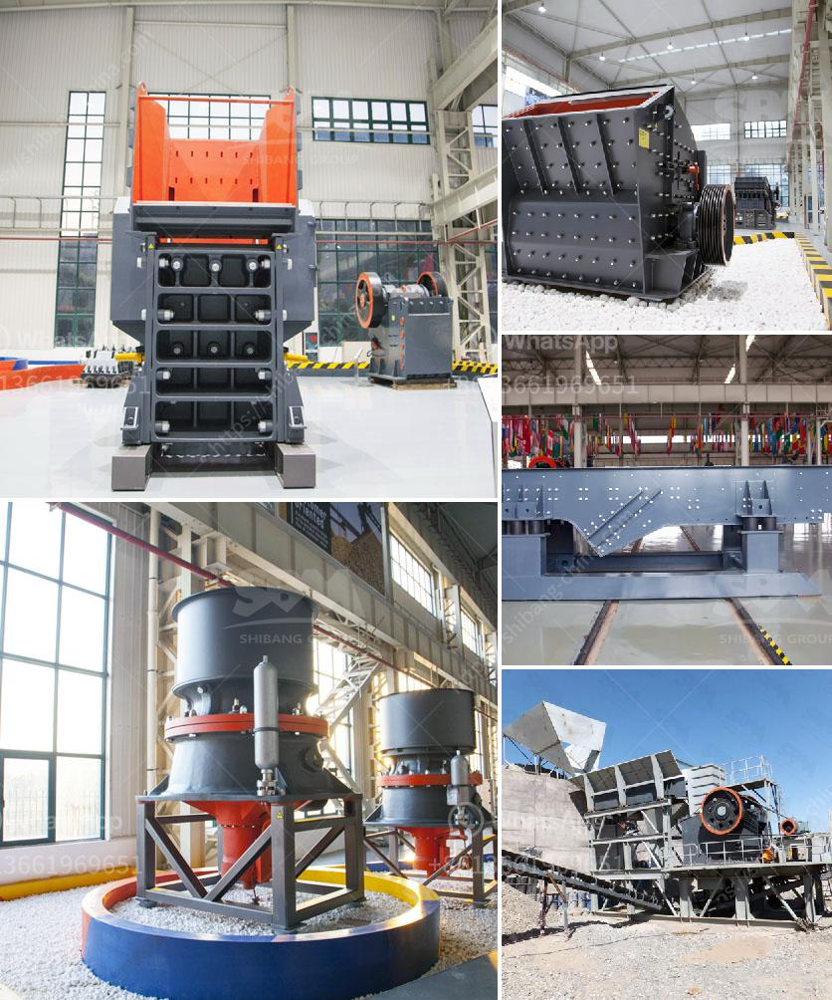

<h3>ball mills for cement grinding</h3>
Ball mills are commonly used in the manufacture of cement and are a vital part of the cement industry. They can grind a wide range of materials such as limestone, clay, and iron ore, ensuring that the quality of the cement is consistent and high. 

Ball mills are designed to work with a grinding media, typically steel balls, to grind the material into a fine powder. The grinding action is achieved by the rotation of the mill, which is filled with balls and the material to be ground. As the mill rotates, the balls cascade and in turn crush the material, creating a finely ground product. 

The size of the balls and the speed of rotation of the mill can be adjusted to control the fineness of the final product. Additionally, other factors like the residence time in the mill and the feed rate can also affect the grinding efficiency. Cement manufacturers carefully control these parameters to achieve the desired quality and grindability of the cement. 

Ball mills are generally low-energy efficient in comparison to other grinding technologies such as vertical roller mills (VRM) and roller presses. However, with advancements in technology, ball mills are becoming more energy-efficient and can now perform as well as or even better than other grinding systems. 

In addition to their use for cement grinding, ball mills are also commonly used in the mining industry, where they grind ores to a desired fineness for further processing. They are also utilized in chemical and mineral processing industries for grinding materials. 

In conclusion, ball mills are crucial equipment in the cement industry for grinding raw materials and achieving the desired quality and grindability of the cement. As technology advances, ball mills are becoming more energy-efficient, ensuring sustainable and environmentally friendly cement production.
<h3>Contact us</h3><ul><li><strong>Whatsapp:&nbsp;<a href="https://wa.me/8613661969651">+8613661969651</a></strong></li><li><a href="https://swt.shibang-china.com/?git&amp;zhl&amp;ball mills for cement grinding"><strong>Online Service(chat now)</strong></a></li></ul><h3>Related</h3><ul><li><a href='indonesia ball mill.md'>indonesia ball mill</a></li><li><a href='coal washing process machine price.md'>coal washing process machine price</a></li><li><a href='malaysia grinder hammer mill manufacturer.md'>malaysia grinder hammer mill manufacturer</a></li><li><a href='calcium carbide making machine used.md'>calcium carbide making machine used</a></li><li><a href='lime processing plant hammer mill.md'>lime processing plant hammer mill</a></li></ul>