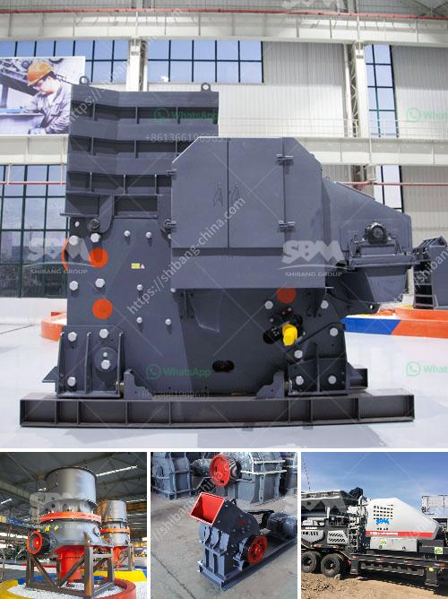

<h3>ball mills for mining</h3>
Ball mills are widely used in the production of cement, silicate products, new building materials, refractory materials, fertilizers, black and non-ferrous metal dressings and glass ceramics, dry or wet grinding of various ores and other grindable materials.

In the process of grinding materials, the ball mill machine adopts the impact and grinding effect of the grinding medium and the ore itself to achieve the crushing of the material. It is mainly used to grind the material into powder under the action of friction and grinding to make ore achieve monomer dissociation and reach the state of complete dissociation.

The ball mill plays an irreplaceable role in the beneficiation production line. Today, I will analyze how it effectively improves the ore grinding process and reduces the production cost.

2. It has large processing capacity and high production efficiency, which greatly reduces the production time and improves the benefit of the enterprise.

3. The quality of the finished product is stable, the particle size distribution is narrow, and it is easy to adjust the fineness of the grinding product.

4. The grinding medium not only has a strong grinding effect on the ore, but also ensures the quality of the grinding product and reduces the over-grinding phenomenon.

5. The ball mill is equipped with a complete set of grading and control system, which can effectively control the particle size distribution of the grinding product and ensure the stability of the product quality.

6. The ball mill is equipped with a special lining board, which greatly improves the grinding efficiency and reduces the energy consumption.

In addition, ball mills for mining are also suitable for grinding various ores and other materials, such as limestone, clinker, marble, granite and so on.

According to the different working principles, the ball mill can be divided into dry and wet types. The dry ball mill is mainly used for grinding powder without adding water, which needs to work with wind grading system. The wet ball mill needs to add water with the use of hydraulic grading system. The wet ball mill has a wider application, which can be used to grind all kinds of metal ore, non-metal ore.

1. Liner plate: The ball mill liner is used to protect the cylinder body from direct impact and friction of the grinding medium and materials. It is also used to adjust the motion state of the grinding body for different grinding materials and grinding conditions.

2. Grinding media: The grinding medium in the ball mill is used to grind and crush the ore. It is generally made of steel balls, steel bars, or ceramic balls. The rod mill is used to grind materials with uniform size, less particle division, and suitable for fine grinding.

In summary, ball mills for mining play an important role in the mining industry. They are the main equipment to grind various ores and minerals and produce qualified products. They are also the necessary equipment for ore dressing production line, which can effectively improve the efficiency of beneficiation production and reduce investment costs.
<h3>Contact us</h3><ul><li><strong>Whatsapp:&nbsp;<a href="https://wa.me/8613661969651">+8613661969651</a></strong></li><li><a href="https://swt.shibang-china.com/?git&amp;zhl&amp;ball mills for mining"><strong>Online Service(chat now)</strong></a></li></ul><h3>Related</h3><ul><li><a href='kenya crushing machinery performance.md'>kenya crushing machinery performance</a></li><li><a href='hammer mills for rocks.md'>hammer mills for rocks</a></li><li><a href='iron processing machine price.md'>iron processing machine price</a></li><li><a href='coal mill manufacturer china.md'>coal mill manufacturer china</a></li><li><a href='200 tph rock crusher.md'>200 tph rock crusher</a></li></ul>