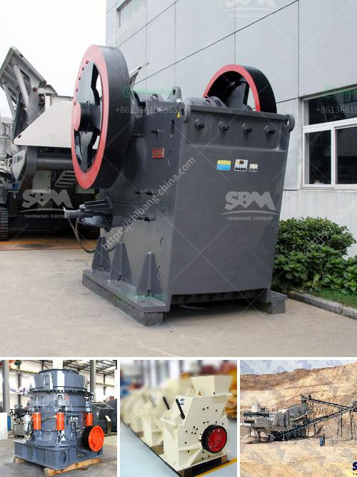

<h3>ball mills used for copper</h3>
Ball mills are a type of grinder used to grind and blend materials for use in various industries. Copper is one of the most commonly used materials in the world, and ball mills are crucial equipment for grinding copper ore into fine powder. Thus, ball mills used in copper mining industries are indispensable in the enrichment process.

The working principle of these mills is quite simple. When the mill's cylinder rotates, the grinding media (balls) crash and grind the ore into powdered form. In the process, copper ore is usually broken down into smaller pieces of 1-2 cm, exposing the copper mineral for further processing.

The grinding process of copper ore varies depending on the type of ore and the desired particle size. Conventionally, copper ores are crushed and ground into a fine powder, and then the copper minerals are separated from gangue minerals using flotation or magnetic separation methods. 

Ball mills used for copper ore grinding are designed with two different types of liner: steel liner and rubber liner. Both of them are wearable materials, which will largely increase the service life of the equipment. With rubber liners, operators can realize longer service intervals, higher mill availability and lower power consumption. Meanwhile, due to the steel liner's high rigidity, it can adapt to most mine site conditions and has excellent stability.

Besides the liner material, the speed of the copper ball mill also plays a crucial role in the grinding process. To optimize the grinding effect, the ball mill speed needs to be adjusted according to the different ore properties. Generally, the most suitable speed for grinding copper ore is 70-80% of the critical speed. 

In recent years, due to the economic downturn and the impact of COVID-19, the demand for copper has been fairly volatile. However, copper remains an essential metal in various industries such as construction, electrical equipment, and automotive sectors. Therefore, the efficient and reliable operation of ball mills for copper ore grinding is of great importance.

To increase productivity and reduce production costs, ball mill manufacturers are investing in advanced technology to improve the grinding efficiency. Advanced technology such as digital twin technology and remote monitoring systems are being utilized to optimize mill performance, minimize downtime, and reduce overall operational costs.

In conclusion, ball mills used for copper ore grinding in mining industries are essential equipment. To ensure efficiency and profitability, it is crucial to optimize the operation of these mills. By implementing advanced technologies and adhering to proper maintenance procedures, operators can enhance the grinding process and achieve desired particle sizes, leading to higher copper recovery rates and increased profits.
<h3>Contact us</h3><ul><li><strong>Whatsapp:&nbsp;<a href="https://wa.me/8613661969651">+8613661969651</a></strong></li><li><a href="https://swt.shibang-china.com/?git&amp;zhl&amp;ball mills used for copper"><strong>Online Service(chat now)</strong></a></li></ul><h3>Related</h3><ul><li><a href='samp hammer mill china.md'>samp hammer mill china</a></li><li><a href='small rock crusher for small scale aggregate producers.md'>small rock crusher for small scale aggregate producers</a></li><li><a href='how to make copper concentrate.md'>how to make copper concentrate</a></li><li><a href='hammer mill equipment south africa price.md'>hammer mill equipment south africa price</a></li><li><a href='grinding mill grinding mill sale.md'>grinding mill grinding mill sale</a></li></ul>