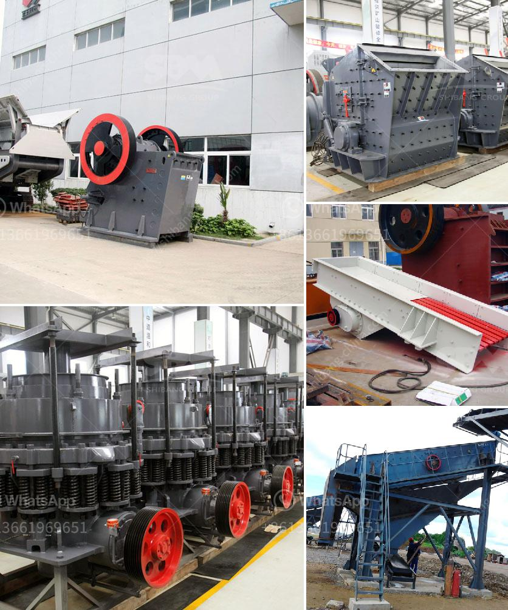

<h3>ball mills used in peru</h3>
In the mining industry, grinding processes are crucial to a company's profitability. New discoveries and extraction techniques increase demand for grinding mills. As a result, the mining industry has seen the need for larger and more efficient grinding equipment. Ball mills are a type of grinding equipment widely used in the mining industry.

Ball mills contribute to the fine grinding of particles in the mining industry. Ball mills are typically used as secondary or tertiary crushers due to their low efficiency and high energy consumption. However, ball mills have a significantly improved grinding capacity and efficiency when compared to traditional crushers. This makes them an important equipment option in grinding circuits.

Peru has a rich mining history and is known for its abundant mineral resources, such as gold, copper, and iron ore. However, the efficient extraction and processing of these minerals require the use of advanced machinery, including ball mills. In Peru, many mining companies rely on ball mills to process and extract minerals, contributing to the growth and development of the industry.

One of the factors that make ball mills popular in Peru is their ability to grind materials to a highly fine and efficient level. This is particularly important for gold extraction processes, where the final product needs to be finely ground to maximize the recovery of gold particles. Ball mills provide the necessary size reduction to achieve this.

Additionally, ball mills used in Peru offer a versatile grinding solution. They can be used for wet or dry grinding, making them suitable for a wide range of minerals and materials. In wet grinding processes, water is added to the mill, which prevents dust and creates a slurry that facilitates the movement of particles. Dry grinding, on the other hand, is often preferred when working with dry or brittle materials.

The maintenance and operation of ball mills in Peru are essential to their longevity and performance. Regular inspections and servicing are required to ensure smooth operation and prevent breakdowns. Proper lubrication of the gears and bearings is crucial, as well as monitoring the mill's performance parameters, such as power consumption and grinding efficiency.

In recent years, technological advancements have improved the design and efficiency of ball mills used in Peru. Manufacturers have developed innovative features, such as automated control systems, which optimize the grinding process and reduce energy consumption. These advancements increase the overall productivity and profitability of mining operations.

In conclusion, ball mills are a vital component in the mining industry in Peru. They enable the efficient grinding of minerals and contribute to the extraction and processing of valuable materials. The versatility, grinding capacity, and technological advancements in ball mill design make them an indispensable piece of equipment in Peruvian mines. Continuous improvements and proper maintenance are necessary to ensure their optimal performance and ensure the sustainability of the mining industry in Peru.
<h3>Contact us</h3><ul><li><strong>Whatsapp:&nbsp;<a href="https://wa.me/8613661969651">+8613661969651</a></strong></li><li><a href="https://swt.shibang-china.com/?git&amp;zhl&amp;ball mills used in peru"><strong>Online Service(chat now)</strong></a></li></ul><h3>Related</h3><ul><li><a href='track crushing plant.md'>track crushing plant</a></li><li><a href='dolamite 450 mash grinding machine.md'>dolamite 450 mash grinding machine</a></li><li><a href='trading industrial stone crushers.md'>trading industrial stone crushers</a></li><li><a href='100tph stone crusher.md'>100tph stone crusher</a></li><li><a href='type of crusher machine is best.md'>type of crusher machine is best</a></li></ul>