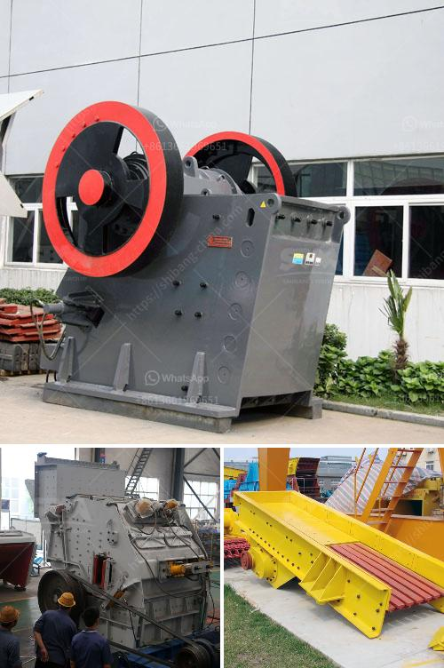

<h3>ballast crusher price in kenya</h3>
Ballast, as one of the major construction materials in Kenya, plays a vital role in building and maintaining railways, roads and other infrastructure projects. As a result, ballast crushing is essential in Kenya, which has seen a significant surge in demand for ballast crushers in recent years.

Kenya is located in the geographic heart of East Africa, which is internationally recognized as one of the fastest-growing regions of the continent. With a stable political system and a growing economy, the country has seen a huge increase in construction projects, leading to a high demand for building materials like ballast.

A ballast crusher is a necessary machine in the construction and maintenance of railway tracks and other infrastructure projects. Since ballast is usually made of crushed stone, the crushing process is necessary to ensure that the stones are evenly crushed for better performance in railway construction.

However, ballast crushers have varying prices. The prices of the ballast crushers in Kenya depend on a variety of factors, including the type, capacity, and specifications of the machine. Additionally, different ballast crushers have different output capacities. In general, the higher the capacity, the higher the price.

To understand the factors affecting the price of ballast crushers in Kenya, we need to look at several key points. Firstly, the price of raw materials, which affect the price of equipment. The raw materials are generally gravel, marble, limestone, and granite. The output specifications of the ballast crushers are usually determined by the size and composition of the raw materials.

Secondly, the capacity of the ballast crusher also plays a significant role in determining the price. A higher capacity means a higher price, as the machine will require more materials and energy to crush the ballast effectively. The capacity of the crusher is usually expressed in tons per hour.

Furthermore, the type of ballast crusher also affects the price. There are two common types of ballast crushers in the market: mobile and stationary crushers. Mobile crushers are convenient as they can be easily moved from one construction site to another. However, they tend to have higher operational costs compared to stationary crushers. On the other hand, stationary crushers are fixed in one place, reducing operational costs but limiting their mobility.

Additionally, the brand of the ballast crusher also influences its price. Well-known international brands tend to have higher prices due to their reputation and quality.

In conclusion, ballast crusher price in Kenya is influenced by many factors. The price range fluctuates between $3,500 and $1 million, depending on the capacity, brand, and specifications of the machine. As the market is continuously expanding, the ballast crusher price in Kenya is expected to continue to rise in the future.
<h3>Contact us</h3><ul><li><strong>Whatsapp:&nbsp;<a href="https://wa.me/8613661969651">+8613661969651</a></strong></li><li><a href="https://swt.shibang-china.com/?git&amp;zhl&amp;ballast crusher price in kenya"><strong>Online Service(chat now)</strong></a></li></ul><h3>Related</h3><ul><li><a href='stone crushing for sale.md'>stone crushing for sale</a></li><li><a href='small bleaching powder manufacturing plant project report.md'>small bleaching powder manufacturing plant project report</a></li><li><a href='sizing jaw crusher.md'>sizing jaw crusher</a></li><li><a href='manufacturer of quartz powder in india.md'>manufacturer of quartz powder in india</a></li><li><a href='barite crusher manufacturer guatemala.md'>barite crusher manufacturer guatemala</a></li></ul>