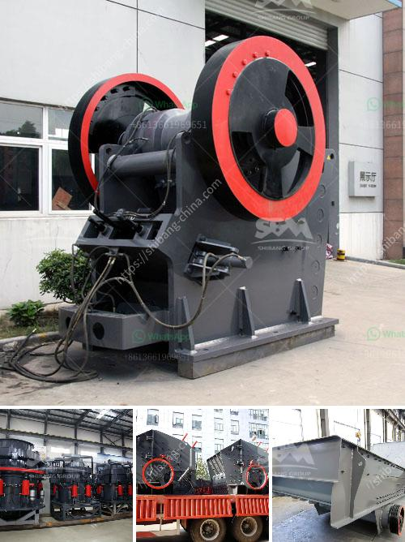

<h3>ballast crushers alibaba</h3>
Railway construction has always been a vital part of a country's infrastructure development. As the backbone of transportation, railways play a crucial role in connecting different regions, supporting trade, and fostering economic growth. One essential element in the construction of railways is the production of high-quality ballast – crushed stones used as a stable foundation for the tracks. And when it comes to finding reliable ballast crushers, Alibaba is a platform that should not be overlooked.

Alibaba is an e-commerce giant that connects buyers and sellers from around the world. It provides a platform for businesses to showcase their products and services to a global audience. As a trusted marketplace, Alibaba acts as a bridge between industrial equipment manufacturers and those in need of their products. Therefore, it comes as no surprise that Alibaba has become a go-to platform for businesses looking to source ballast crushers.

But what exactly are ballast crushers, and why are they crucial in railway construction? Ballast crushers are machines designed to crush stones into smaller sizes, providing an essential component for railway tracks. The crushed stones, known as ballast, are then laid over a prepared sub-base, creating a stable and reliable foundation. This foundation ensures that the tracks remain intact, even under heavy loads and in adverse weather conditions.

When it comes to ballast crushers, Alibaba offers a wide range of options from various manufacturers, allowing buyers to choose the most suitable ones for their specific needs. With an extensive selection of crushers available on the platform, buyers can easily compare different models, features, and prices. Additionally, Alibaba provides a rating and review system, enabling customers to make well-informed decisions based on the experiences of previous buyers.

The ballast crushers found on Alibaba are known for their durability, efficiency, and reliability. Manufacturers on the platform ensure that their crushers are made from high-quality materials and are built to withstand the harsh conditions of railway construction sites. These crushers are equipped with advanced technology, such as hydraulic systems and high-speed rotating blades, ensuring rapid and efficient crushing of stones.

Furthermore, Alibaba offers competitive prices for ballast crushers, thanks to the direct communication between manufacturers and buyers. By eliminating middlemen and unnecessary costs, businesses can obtain these essential machines at reasonable prices, saving both time and money. Additionally, Alibaba provides secure payment options, ensuring a smooth and trustworthy purchasing process.

Ultimately, the availability of ballast crushers on Alibaba plays a critical role in the efficient and timely completion of railway construction projects. With easy access to a wide range of crushers, buyers can find the most suitable equipment for their specific needs. By investing in high-quality ballast crushers, businesses can ensure the durability and longevity of railway tracks, offering safe and reliable transportation for generations to come.

In conclusion, Alibaba serves as a valuable platform for those in need of ballast crushers, offering a vast selection, competitive prices, and reliable suppliers. With Alibaba's assistance, businesses involved in railway construction can easily find the essential equipment they require to create a solid foundation for their projects. As the demand for modern and efficient transportation infrastructure continues to grow, Alibaba remains a trusted resource for sourcing ballast crushers and unlocking the potential of railway construction.
<h3>Contact us</h3><ul><li><strong>Whatsapp:&nbsp;<a href="https://wa.me/8613661969651">+8613661969651</a></strong></li><li><a href="https://swt.shibang-china.com/?git&amp;zhl&amp;ballast crushers alibaba"><strong>Online Service(chat now)</strong></a></li></ul><h3>Related</h3><ul><li><a href='feldspar powder suppliers.md'>feldspar powder suppliers</a></li><li><a href='portable stone crushers uganda for sale.md'>portable stone crushers uganda for sale</a></li><li><a href='vertical horizontal ball milling machine.md'>vertical horizontal ball milling machine</a></li><li><a href='hammer mill and impactors unit.md'>hammer mill and impactors unit</a></li><li><a href='stone crusher machine in turkey.md'>stone crusher machine in turkey</a></li></ul>