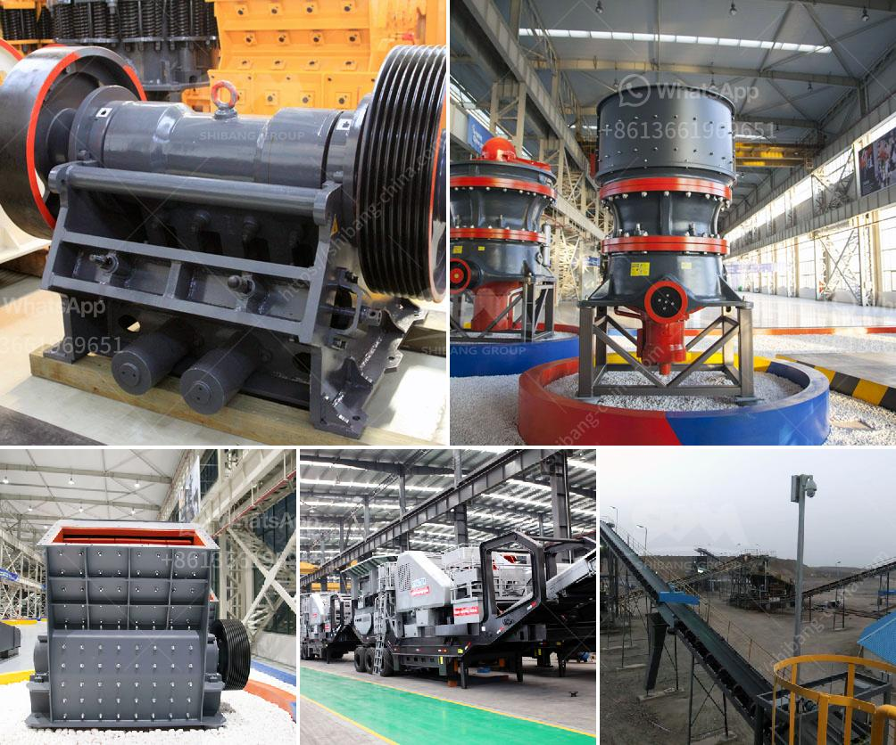

<h3>ballast crushers in kenya</h3>
In Kenya, ballast crushers are machines that are utilized to break down rock into varying sizes for the purpose of producing railway ballast. The ballast crushers sold in Kenya, often used to handle larger stones, are designed to provide a constant, level of pressure to ultimately crush the stone into desired sizes. Stone crushing is a tough job that requires great attention to detail and perseverance. It is no secret that ballast crushers play a vital role in providing interchange stations for the well-functioning of railways in Kenya.

Kenyan government has invested significantly in developing the country's railway system to enhance connectivity and bolster trade activities. To construct a new railway line or to maintain an existing one, quality ballast is a basic requirement. Without an adequate supply of ballast, the railway infrastructure may suffer from potential instability and higher maintenance costs.

Ballast crushers are specially designed to meet the challenges of producing high-quality track ballast, ensuring that the crushed stones are durable and free from dust. Additionally, these crushers are also used to crush gravels, rocks, limestone, granite, basalt, and gypsum into desired shapes such as gravel and sand. With multiple sizes and shapes available, users have the flexibility to match ballast specifications to their particular project needs.

One of the key advantages of utilizing ballast crushers in Kenya is the reduction in production costs achieved through a more efficient process of crushing. This lowers the cost of transportation and eliminates the need for multiple machines in the crushing process. Furthermore, investing in ballast crushers reduces overhead costs since these machines operate continuously, resulting in higher output and productivity.

Another benefit of using ballast crushers in Kenya is the fact that they generate a minimal amount of dust. This helps to maintain air quality, preventing irritation to respiratory systems and reducing the risk of health issues among workers, both at the site and nearby communities.

In conclusion, ballast crushers are an integral part of the infrastructure development in Kenya. They ensure the quality of crushed stones needed for various construction activities, whether it is for railways, road construction, or civil engineering projects. These machines provide a significant reduction in production costs, increased efficiency, and improved air quality. Therefore, investing in ballast crushers not only contributes to the overall growth of the construction industry but also promotes sustainable development by minimizing the negative impact on the environment.

As Kenya continues to advance its infrastructure, the demand for ballast crushers is expected to rise. Manufacturers and suppliers should embrace technological advancements to produce crushers that meet the ever-evolving needs of the market. By investing in the right equipment and implementing efficient processes, Kenya can continue to develop a robust railway network and provide better connectivity for its people.
<h3>Contact us</h3><ul><li><strong>Whatsapp:&nbsp;<a href="https://wa.me/8613661969651">+8613661969651</a></strong></li><li><a href="https://swt.shibang-china.com/?git&amp;zhl&amp;ballast crushers in kenya"><strong>Online Service(chat now)</strong></a></li></ul><h3>Related</h3><ul><li><a href='grinding mill machine malaysia.md'>grinding mill machine malaysia</a></li><li><a href='price of grinder machine.md'>price of grinder machine</a></li><li><a href='advantages of reversible impact hammer crusher.md'>advantages of reversible impact hammer crusher</a></li><li><a href='china cone crushers.md'>china cone crushers</a></li><li><a href='granite crusher machine philippines.md'>granite crusher machine philippines</a></li></ul>