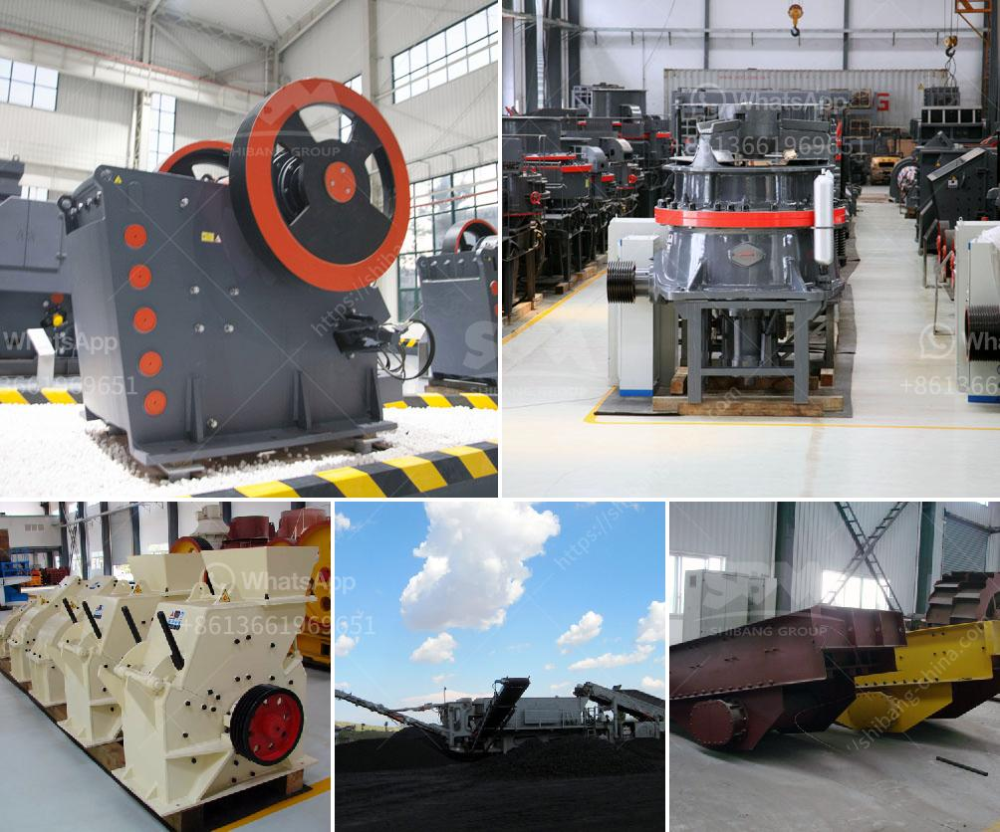

<h3>ballast crushing equipment in kenya</h3>
Ballast crushing equipment plays a vital role in Kenya's infrastructure and economic development. In recent years, the demand for ballast has been increasing due to the explosive growth of construction projects. An abundance of raw materials such as limestone and granite is spread across various regions in Kenya. The ballast crushing machine manufactured by SBM is an essential apparatus in the production of ballast, which ultimately contributes to the national development.

With the ever-increasing demand for ballast, Kenya's infrastructure development program is prioritizing the construction of railway and road networks. Some major projects like the Standard Gauge Railway (SGR) and the Nairobi-Mombasa highway greatly expect the presence of quality ballast materials. The crushed stones used for ballast installations are naturally obtained from quarries conveniently located near the railway lines. This proximity ensures cost-effective and efficient transportation, reducing delays and additional logistics expenses.

The ballast crushing equipment involved in the production of ballast are jaw crusher, impact crusher, and cone crusher. These different equipment have different working principles. Jaw crusher uses the working principle of jaw extrusion to crush the materials. It has higher crushing efficiency compared to other types of equipment. Impact crusher uses impact force to crush materials, which is suitable for the medium and fine crushing of various rocks. Cone crusher crushes materials by the action of an eccentric sleeve, which is suitable for secondary crushing and tertiary crushing.

Additionally, SBM ballast crushing equipment can process materials from local quarries with various sizes, ranging from 0-5mm, 5-10mm, 10-20mm to 20-40mm, or customized sizes. Besides, the production line is also equipped with vibrating feeder, vibrating screen, and belt conveyor to optimize the crushing process and improve the end product quality.

In conclusion, ballast crushing equipment plays a vital role in the infrastructure and economic development of Kenya. SBM offers a wide range of ballast crushers for customers to choose from, making it the preferred manufacturer in the market. The equipment not only has strong crushing capacity but also has a long service life, ensuring the quality and efficiency of ballast production. As Kenya's infrastructure continues to grow, the demand for ballast will increase, and SBM will continue to provide the most suitable equipment to meet various customer requirements.
<h3>Contact us</h3><ul><li><strong>Whatsapp:&nbsp;<a href="https://wa.me/8613661969651">+8613661969651</a></strong></li><li><a href="https://swt.shibang-china.com/?git&amp;zhl&amp;ballast crushing equipment in kenya"><strong>Online Service(chat now)</strong></a></li></ul><h3>Related</h3><ul><li><a href='gypsum recycling plant.md'>gypsum recycling plant</a></li><li><a href='150 tpd cement line price.md'>150 tpd cement line price</a></li><li><a href='marble production line germany.md'>marble production line germany</a></li><li><a href='andhra pradesh coal crusher equipment price.md'>andhra pradesh coal crusher equipment price</a></li><li><a href='portable stone crushers uganda for sale.md'>portable stone crushers uganda for sale</a></li></ul>