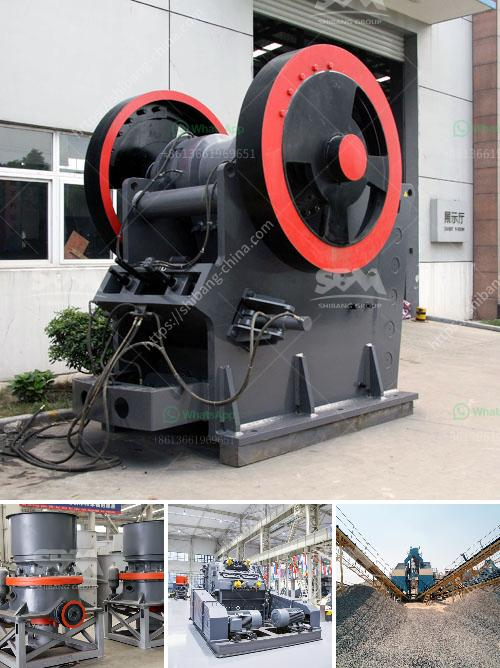

<h3>ballast crushing machine small</h3>
Ballast crushing machines, also known as ballast crushers, are the mechanical devices that are used to reduce the size of rocks or change the form of waste materials so that they can be recycled or easily disposed of. These machines are widely used in construction sites and railway track formations. The purpose of ballast crushing is to produce small pieces of ballast that can be used to lay railway tracks and provide strength and stability to the overall track system.

The size of ballast varies from 1.5 inches to 2.5 inches. However, smaller size ballast is required for tracks with tight curves and smaller radius. The small ballast crushing machines manufactured by various companies can produce ballast that ranges from 20-40mm in diameter.

These small ballast crushing machines are highly efficient and have a high production capacity. Operating at full capacity, they can produce up to 120 tons per hour, which is quite impressive for machines of this size. The compact design of these machines allows them to be easily transported and set up on-site.

Moreover, these machines are highly versatile and can crush ballast made of different materials such as granite, basalt, limestone, etc. This flexibility allows them to be used in various construction projects, including the construction of buildings, roads, and railway tracks.

In addition to their small size and high production capacity, these ballast crushing machines are also known for their low operational costs. They consume less power and require minimal maintenance, making them cost-effective in the long run.

In conclusion, ballast crushing machines small in size but big on efficiency are essential devices in the construction industry. These machines play a crucial role in producing high-quality ballast that provides stability to railway tracks and helps maintain the overall integrity of the track system. Their versatility, compact design, and low operational costs make them an ideal choice for construction sites and railway infrastructure projects.
<h3>Contact us</h3><ul><li><strong>Whatsapp:&nbsp;<a href="https://wa.me/8613661969651">+8613661969651</a></strong></li><li><a href="https://swt.shibang-china.com/?git&amp;zhl&amp;ballast crushing machine small"><strong>Online Service(chat now)</strong></a></li></ul><h3>Related</h3><ul><li><a href='components of mobile coal processing plant.md'>components of mobile coal processing plant</a></li><li><a href='rock crusher from china.md'>rock crusher from china</a></li><li><a href='stationary screening for screening process.md'>stationary screening for screening process</a></li><li><a href='mining hammer mill suppliers.md'>mining hammer mill suppliers</a></li><li><a href='granite stone crusher india.md'>granite stone crusher india</a></li></ul>