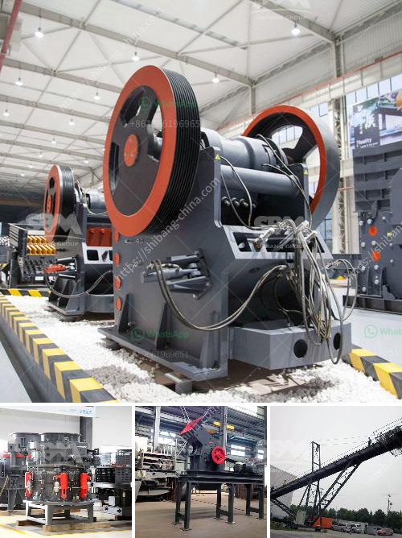

<h3>ballast quarry crusher machines</h3>
Ballast is a crucial resource for the construction industry, providing essential materials for roads, railways, and buildings. The production of ballast involves extraction and crushing processes, which require the use of heavy-duty machinery. Ballast quarry crusher machines are specifically designed to manage the demanding tasks of ballast production, and provide an efficient and sustainable solution for infrastructure projects.

The ballast quarry machine for sale is widely used in ballast track projects. It has the advantages of large production capacity, high crushing efficiency, high automation degree, and easy operation. The quarry crushing machine's crushing ratio is large and the crushing strength is uniform. 3. The discharge port can be adjusted, so it can meet the needs of different customers. For different customers with different production requirements, the ballast quarry machine can also be equipped with a dust removal device to protect the environment.

The ballast quarry plant includes jaw crusher, impact crusher, cone crusher, belt conveyor, vibrating screen and grinder mill. The team of mining machine and operators at a ballast quarry handles the crushing of the stones to form ballasts for various uses in construction projects. In addition, the crusher station receives bulk material from quarries in the surrounding area and reduces it to pieces of 40mm and below. The small pieces can be used as gravel for new construction projects and other uses.

The railway industry has long relied on the use of stone aggregates in its tracks, which act as a stabilizing layer. The ballast quarry machine plays a critical role in the production of high-quality railway ballast. The equipment is designed to meet the specifications for ballast used in various types of railway tracks. It typically consists of jaw crusher, impact crusher, cone crusher, and VSI crusher. They provide crushing solutions for the demanding ballast production environment.

In a ballast quarry plant, the crusher machine is mainly used in primary and secondary crushing process. The jaw crusher is commonly used as primary crushing machine for simple structure, large production capacity, easy operation, reliable performance and convenient maintenance etc. The impact crusher is generally used to crush brittle material with medium hardness, such as limestone, coal, calcium carbide, quartz, dolomite, iron sulfide ore, gypsum and chemical raw material etc. It is mainly used for fine and medium crushing of materials with low hardness and brittle materials.

Cone crusher and VSI crusher are the alternative mining equipment to the traditional impact crusher. They are suitable for crushing materials with different hardness levels and different uses. Cone crushers are mainly used for secondary crushing, while VSI crushers are used for tertiary and quaternary crushing.

In conclusion, ballast quarry crusher machines play an important role in the construction industry, providing the necessary aggregates for the production of tracks, buildings, and other infrastructure. With popular models like jaw crusher, impact crusher, cone crusher, and VSI crusher, the machines ensure high-quality end products and great reliability for contractors. Moreover, these machines are designed to be eco-friendly by reducing environmental impact through dust removal systems. Overall, ballast quarry crusher machines are the key equipment in ballast production, making the whole process more efficient and sustainable.
<h3>Contact us</h3><ul><li><strong>Whatsapp:&nbsp;<a href="https://wa.me/8613661969651">+8613661969651</a></strong></li><li><a href="https://swt.shibang-china.com/?git&amp;zhl&amp;ballast quarry crusher machines"><strong>Online Service(chat now)</strong></a></li></ul><h3>Related</h3><ul><li><a href='raymond grinding mill in pakistan.md'>raymond grinding mill in pakistan</a></li><li><a href='crusher plant quarry philippines.md'>crusher plant quarry philippines</a></li><li><a href='cost for the ball mill machines.md'>cost for the ball mill machines</a></li><li><a href='indonesia coal screen machine.md'>indonesia coal screen machine</a></li><li><a href='mobile iron ore crusher.md'>mobile iron ore crusher</a></li></ul>