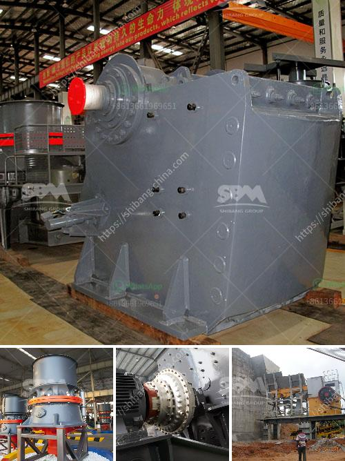

<h3>barit mineral processing and extractive malaysia</h3>
Barite, or barium sulfate, is a mineral that can be found in various regions around the world. It is known for its high density and very low solubility, making it valuable in a variety of industries. Malaysia, in particular, has a significant presence in the barite industry due to its rich reserves and strategic location.

The process of barite mineral processing involves crushing, screening, and jigging. The resulting product is a fine powder that is used in various industries such as oil and gas, drilling fluids, and pharmaceuticals. Malaysia, with its advanced mining and processing technology, is able to produce high-quality barite products that meet international standards.

One of the main uses of barite is in the oil and gas industry. It is commonly used as a weighting agent in drilling fluids to help control the pressure and increase the efficiency of the drilling process. Malaysia, being a major player in the oil and gas industry, has a high demand for barite. The country exports a significant amount of its barite production to other countries in the region.

In addition to its use in drilling fluids, barite is also used in other industrial applications. It is widely used in the production of paints, ceramics, rubber, and plastics. Its high density makes it an ideal filler material for these industries. Malaysia's advanced processing technology allows for the production of finely ground barite powder, which is in high demand in these industries.

The extractive industry in Malaysia plays a crucial role in the country's economy. With an abundance of natural resources, including barite, Malaysia has become a major player in the global market. The country's mining and processing companies employ advanced technology and adhere to strict environmental regulations to ensure sustainable extraction practices.

Malaysia's strategic location in Southeast Asia also gives it a competitive advantage in the barite industry. It is well-positioned to serve the growing demand for barite in neighboring countries such as Thailand, Indonesia, and Vietnam. The country's well-developed infrastructure and shipping capabilities make it a reliable supplier for these markets.

The barite industry in Malaysia contributes significantly to the country's export revenue and job creation. It provides employment opportunities for thousands of Malaysians in mining, processing, and logistics. The revenue generated from barite exports contributes to the country's economic growth and development.

In conclusion, Malaysia's barite industry is a vital contributor to the country's economy. The advanced mining and processing technology, coupled with strict environmental regulations, enable Malaysia to produce high-quality barite products that meet international standards. The strategic location and well-developed infrastructure further enhance the country's competitiveness in the global market. With the growing demand for barite in various industries, Malaysia is poised to continue playing a significant role in the barite mineral processing and extractive industry.
<h3>Contact us</h3><ul><li><strong>Whatsapp:&nbsp;<a href="https://wa.me/8613661969651">+8613661969651</a></strong></li><li><a href="https://swt.shibang-china.com/?git&amp;zhl&amp;barit mineral processing and extractive malaysia"><strong>Online Service(chat now)</strong></a></li></ul><h3>Related</h3><ul><li><a href='dolomite crushing plant in bharuch.md'>dolomite crushing plant in bharuch</a></li><li><a href='jaw crusher price nigeria.md'>jaw crusher price nigeria</a></li><li><a href='rock crusher machine equipment in canada.md'>rock crusher machine equipment in canada</a></li><li><a href='plant of quartz poweder is salling out.md'>plant of quartz poweder is salling out</a></li><li><a href='small gold mining plant in south africa.md'>small gold mining plant in south africa</a></li></ul>