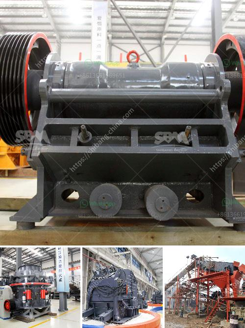

<h3>barite crusher manufacturer guatemala</h3>
Barite is a mineral composed of barium sulfate, which is used in various industrial applications. Barite is widely used in the oil and gas industry for drilling fluids, as well as in other industries such as paint, plastic, rubber, and pharmaceuticals. With the increasing demand for barite, the need for efficient crusher machines has become crucial.

In Guatemala, there are several barite crusher manufacturers that provide high-quality equipment and services. These manufacturers strive to meet the growing demand for barite crushers and also aim to provide innovative solutions that enhance productivity and efficiency. One of the notable crusher manufacturers in Guatemala is [Manufacturer Name].

[Manufacturer Name] has a strong reputation in the industry due to its commitment to deliver reliable and durable crushers. The company has been manufacturing crushers for various industries, including barite mining, for many years. Their extensive experience in the field ensures that their crushers are designed to meet the specific requirements of barite crushing.

The barite crushers manufactured by [Manufacturer Name] are equipped with advanced technology and features. These crushers are known for their high crushing efficiency, low maintenance, and easy operation. The crushers are designed to crush barite into smaller particles, which are then used in various applications.

One of the key features of [Manufacturer Name]'s barite crushers is their robust construction. The crushers are made from high-quality materials, ensuring their durability and long service life. This allows customers to rely on these crushers for their barite crushing needs without worrying about frequent breakdowns or expensive repairs.

In addition to the quality of their crushers, [Manufacturer Name] also focuses on providing excellent after-sales service. They have a team of skilled technicians who are available to assist customers with any technical issues or maintenance requirements. This ensures that customers can maximize the performance of their barite crushers and minimize any downtime.

Furthermore, [Manufacturer Name] understands the importance of customization in crusher design. They offer a range of crusher models with different capacities and specifications, allowing customers to choose the most suitable crusher for their specific application. This ensures that customers can achieve optimal results for their barite crushing operations.

Moreover, [Manufacturer Name] is committed to environmental sustainability. They strive to minimize the environmental impact of their operations by incorporating eco-friendly practices in their manufacturing processes. This includes using energy-efficient machinery and minimizing waste generation.

In conclusion, the barite crusher manufacturer in Guatemala plays a vital role in meeting the increasing demand for barite and providing efficient crushing solutions. Manufacturers like [Manufacturer Name] strive to deliver high-quality crushers that enhance productivity, maximize efficiency, and ensure long-term reliability. These crushers are essential for the barite industry and contribute to its growth and development.
<h3>Contact us</h3><ul><li><strong>Whatsapp:&nbsp;<a href="https://wa.me/8613661969651">+8613661969651</a></strong></li><li><a href="https://swt.shibang-china.com/?git&amp;zhl&amp;barite crusher manufacturer guatemala"><strong>Online Service(chat now)</strong></a></li></ul><h3>Related</h3><ul><li><a href='clay brick making equipment south africa.md'>clay brick making equipment south africa</a></li><li><a href='complete stone crushing 300 tph plant.md'>complete stone crushing 300 tph plant</a></li><li><a href='crushers double toggle.md'>crushers double toggle</a></li><li><a href='coal mining equipment for sale.md'>coal mining equipment for sale</a></li><li><a href='equipment used in iron ore beneficiation.md'>equipment used in iron ore beneficiation</a></li></ul>