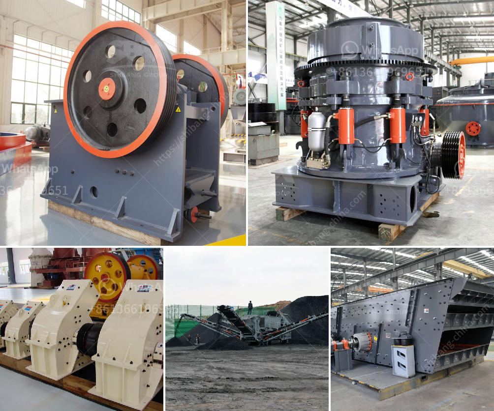

<h3>barite grinding processing plant for sale</h3>
Barite is a mineral composed of barium sulfate (BaSO4). It is usually colorless or milky white, but can also be found in shades of gray, brown, or blue. Barite is widely used in various industries, including oil and gas exploration, drilling fluids, paint, ceramics, metallurgy, and medicine.

To meet the growing demand for barite, many mining companies have expanded their operations and established barite grinding processing plants. These plants allow the efficient and cost-effective grinding of barite ore into finer and more uniform particles. With the advancement in technology, the grinding process has become increasingly automated, resulting in higher production rates and lower operating costs.

The barite grinding processing plant for sale consists of various machinery and equipment, such as crushers, mills, vibrating screens, feeders, and belt conveyors. These equipment are widely used in the barite grinding processing plant.

A barite grinding processing plant can also be called barite processing mill. It can be used for processing all kinds of non-flammable and explosive mineral materials with Mohs hardness below 9.3 and humidity below 7%. It is widely used in the fields of metallurgy, construction, chemical industry, mining, highway construction, etc.

Barite grinding processing plants have a wide range of applications. After being processed into fine powder, barite can be used as a weighting agent for drilling mud in oil and gas exploration. It can also be used as a raw material for the production of white pigment, as well as for the production of barium compounds for various purposes, such as rat poison and fireworks.

The barite grinding processing plant for sale is equipped with different kinds of the grinding machine such as Mills and Mircro Pulverizers. In order to achieve the final desired fineness, the grinding mills and pulverizers are essential. For barite quarry or mining, it’s important to design and choose suitable barite crushing plant including barite crusher and barite grinding machine. When choosing the right barite crusher, you should consider the reduction ratio according to the requirement of the barite crushing system.

Barite grinding processing plant is also called barite mill, Raymond mill, ultrafine mill; In addition to the high quality barite grinding mill equipment, we also have a complete set of services including pre-sale service, sale service and after-sale service. It can be used to producing top-grade barite powders for industries like oil drilling, paint, pigment, coating, plastic, rubber, cosmetic, etc.

In conclusion, with the rapid development of the mining industry, new barite grinding processing plants are continuously being established to meet the increasing demand for barite. These processing plants not only provide barite with a wide range of applications but also contribute to the economic growth of the local community. Therefore, the sale of barite grinding processing plants offers a great investment opportunity for both investors and mining companies.
<h3>Contact us</h3><ul><li><strong>Whatsapp:&nbsp;<a href="https://wa.me/8613661969651">+8613661969651</a></strong></li><li><a href="https://swt.shibang-china.com/?git&amp;zhl&amp;barite grinding processing plant for sale"><strong>Online Service(chat now)</strong></a></li></ul><h3>Related</h3><ul><li><a href='mobile stone crusher available for hire.md'>mobile stone crusher available for hire</a></li><li><a href='cement clinker grinding plant in india.md'>cement clinker grinding plant in india</a></li><li><a href='beneficiation plant for feldspar japan.md'>beneficiation plant for feldspar japan</a></li><li><a href='gypsum crusher in salalah oman.md'>gypsum crusher in salalah oman</a></li><li><a href='project report of m sand plant.md'>project report of m sand plant</a></li></ul>