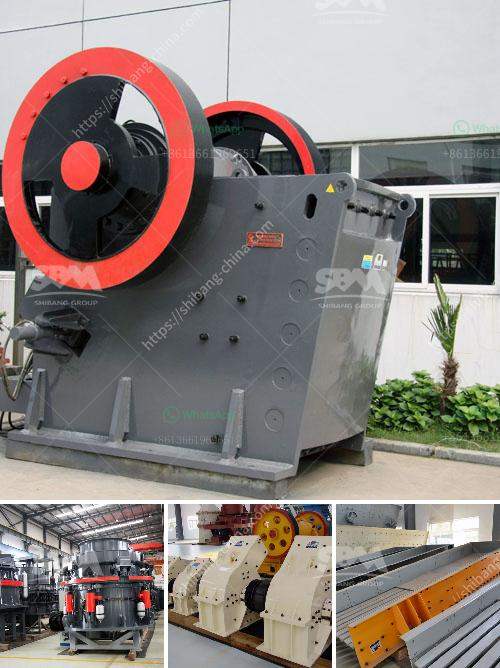

<h3>barite mining equipment</h3>
Barite, also known as baryte, is a white or colorless mineral composed of barium sulfate (BaSO4). It is a naturally occurring mineral and has a wide variety of uses due to its high density and white, opaque appearance. Barite is commonly used in the oil and gas drilling industry as a weighting agent for drilling fluids. It is also used in various industrial applications such as paints, rubber, and plastics.

Barite mining is a lucrative business that comes with a high risk of environmental damage. To ensure responsible mining practices, it is crucial to have the right equipment in place. The mining process involves extracting barite from the earth using heavy machinery such as crushers and grinders, which can cause significant damage to the environment if not properly managed.

One of the essential pieces of equipment used in barite mining is the barite grinding machine, which is used to grind the barite ore into fine particles. The barite grinding machine has a high grinding efficiency, large processing capacity, and low energy consumption. It also produces uniform particle size distribution, making it suitable for various industrial applications.

Another important piece of equipment in barite mining is the barite flotation machine. This machine uses water and chemicals to separate the barite from other minerals, ensuring a high purity level. The barite flotation machine has a compact structure, convenient operation, and high efficiency.

To protect the environment during barite mining activities, it is crucial to adopt proper waste management practices. This includes the use of sedimentation tanks to separate the solids from the wastewater generated during the mining process. Additionally, the re-vegetation of the mining area after extraction can help restore the ecosystem and minimize the environmental impact.

In conclusion, barite mining is a profitable industry that has various applications. However, it must be conducted responsibly, with the right equipment and proper waste management practices in place. With the use of efficient and environmentally friendly equipment, barite mining can continue to thrive while minimizing its impact on the ecosystem.
<h3>Contact us</h3><ul><li><strong>Whatsapp:&nbsp;<a href="https://wa.me/8613661969651">+8613661969651</a></strong></li><li><a href="https://swt.shibang-china.com/?git&amp;zhl&amp;barite mining equipment"><strong>Online Service(chat now)</strong></a></li></ul><h3>Related</h3><ul><li><a href='how to build a gold wash plant.md'>how to build a gold wash plant</a></li><li><a href='lister petter maize hammer mills.md'>lister petter maize hammer mills</a></li><li><a href='sand washing machines for crusher nepal.md'>sand washing machines for crusher nepal</a></li><li><a href='hammer mills for sale in south africa.md'>hammer mills for sale in south africa</a></li><li><a href='mining and quarry machines manifactures.md'>mining and quarry machines manifactures</a></li></ul>