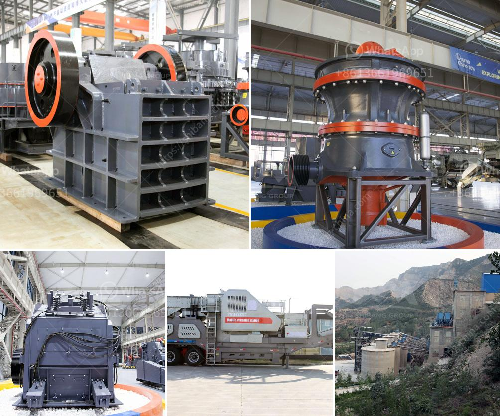

<h3>basalt crusher production</h3>
Basalt is a common rock found in the Earth's crust. It is a dense, fine-grained rock with a dark color, often used as a raw material in construction and manufacturing industries. Basalt has excellent strength and durability, making it an ideal material for producing high-quality crushed stone.

The process of basalt crusher production involves several stages. First, the large basalt materials are evenly fed into the jaw crusher by the vibrating feeder through the silo for primary crushing. The coarsely crushed materials are then conveyed to the impact crusher or cone crusher through a belt conveyor for secondary crushing.

In the secondary crushing stage, the basalt is further crushed into smaller pieces of varying sizes. The impact crusher and cone crusher are commonly used for this purpose. These crushers break down the larger basalt rocks into smaller pieces with the help of high-speed, rotating hammers or cones. This process results in finely crushed basalt suitable for use in various construction projects.

The crushed basalt is then screened to separate the desired sizes of stones. This screening process involves passing the crushed material through different-sized screens, which sort the stones into different categories. The sorted basalt stones are then stored in designated storage areas for further use.

The basalt crusher production process offers several advantages for construction companies and manufacturers. Firstly, the use of basalt as a raw material ensures the production of high-quality crushed stone, which is essential for the construction industry. Basalt stones are known for their exceptional strength and durability, making them ideal for road construction, concrete production, and various other applications.

Another advantage of basalt crusher production is its environmentally friendly nature. Unlike other materials, which may emit harmful pollutants during production, basalt mining and crushing have a minimal impact on the environment. Basalt is a naturally occurring rock that does not require extensive mining or chemical processing, reducing the carbon footprint associated with its production.

Furthermore, the availability of basalt as a raw material is abundant, making it a cost-effective option for construction companies and manufacturers. Basalt is widely distributed across the globe and can be found in large quantities in areas such as the Mid-Atlantic Ridge, Iceland, Hawaii, and the Deccan Traps in India. This availability ensures a steady supply of basalt for crusher production, reducing the dependence on other materials.

In conclusion, basalt crusher production is a valuable process for the construction industry and manufacturing sector. The use of basalt as a raw material ensures the production of high-quality crushed stone, which offers strength, durability, and sustainability. The environmental advantages of basalt production, combined with its cost-effectiveness and abundant availability, make it an excellent choice for various construction projects.
<h3>Contact us</h3><ul><li><strong>Whatsapp:&nbsp;<a href="https://wa.me/8613661969651">+8613661969651</a></strong></li><li><a href="https://swt.shibang-china.com/?git&amp;zhl&amp;basalt crusher production"><strong>Online Service(chat now)</strong></a></li></ul><h3>Related</h3><ul><li><a href='gold mining machines manufacturers from italy.md'>gold mining machines manufacturers from italy</a></li><li><a href='small rock crusher for small scale aggregate producers.md'>small rock crusher for small scale aggregate producers</a></li><li><a href='produsen mesin ultra fine grinding.md'>produsen mesin ultra fine grinding</a></li><li><a href='conveyor belt manufacturer in china.md'>conveyor belt manufacturer in china</a></li><li><a href='vibrating screen peru.md'>vibrating screen peru</a></li></ul>