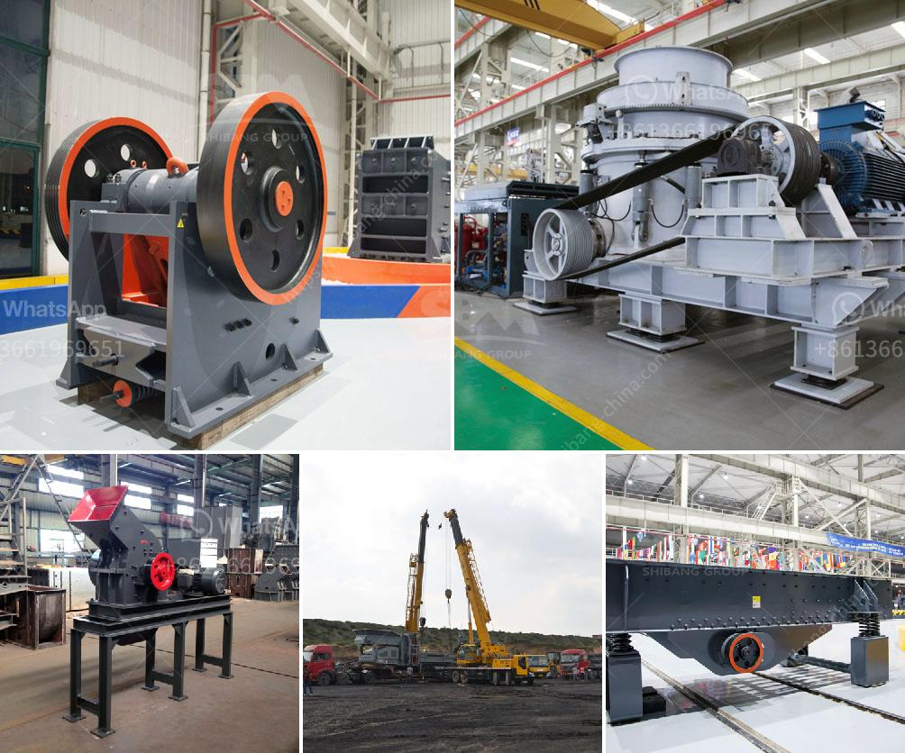

<h3>basalt crushing machine</h3>
Basalt, a common igneous rock formed from solidified lava, is one of the most abundant rocks on earth. It is tough and durable, making it a popular material in construction, road building, and landscaping. To obtain basalt aggregate, the raw material is first crushed into small particles using a basalt crushing machine.

One popular machine used for this process is a jaw crusher. This machine is ideal for primary and secondary crushing, ensuring the particles are uniform and controlled in size. It features a high crushing ratio, easy maintenance, and low operating costs. Additionally, the jaw crusher is designed with a deep crushing chamber, which provides excellent productivity and high reduction ratio.

In addition to the jaw crusher, another commonly used machine for basalt crushing is the impact crusher. It uses impact force to crush materials and is often used to process medium-hard and soft rocks, such as limestone, gypsum, and marble. The impact crusher has a high production capacity, low energy consumption, and excellent particle shape.

Furthermore, a cone crusher can also be utilized for basalt crushing. This machine is known for its superior crushing performance and reliability. The cone crusher operates by compressing the material between an eccentrically rotating mantle and a concave, preventing the material from escaping at the opening. It is typically used for secondary and tertiary crushing stages.

In conclusion, a basalt crushing machine is essential in the basalt quarrying process. Its high efficiency, well-distributed final product size, and low energy consumption make it a favorable choice for crushing basalt rocks. Whether you need a primary jaw crusher, an impact crusher for secondary crushing, or a cone crusher for tertiary crushing, there are many options available to suit your specific needs. Consider the production requirements, operating costs, and maintenance when selecting the appropriate machine for your basalt crushing operation.
<h3>Contact us</h3><ul><li><strong>Whatsapp:&nbsp;<a href="https://wa.me/8613661969651">+8613661969651</a></strong></li><li><a href="https://swt.shibang-china.com/?git&amp;zhl&amp;basalt crushing machine"><strong>Online Service(chat now)</strong></a></li></ul><h3>Related</h3><ul><li><a href='vibrating screens 250tph.md'>vibrating screens 250tph</a></li><li><a href='dry processing machine supplier.md'>dry processing machine supplier</a></li><li><a href='cone crusher on rent in orissa.md'>cone crusher on rent in orissa</a></li><li><a href='the cost of grinding machine in uganda.md'>the cost of grinding machine in uganda</a></li><li><a href='lancaster building supply in vryheid.md'>lancaster building supply in vryheid</a></li></ul>