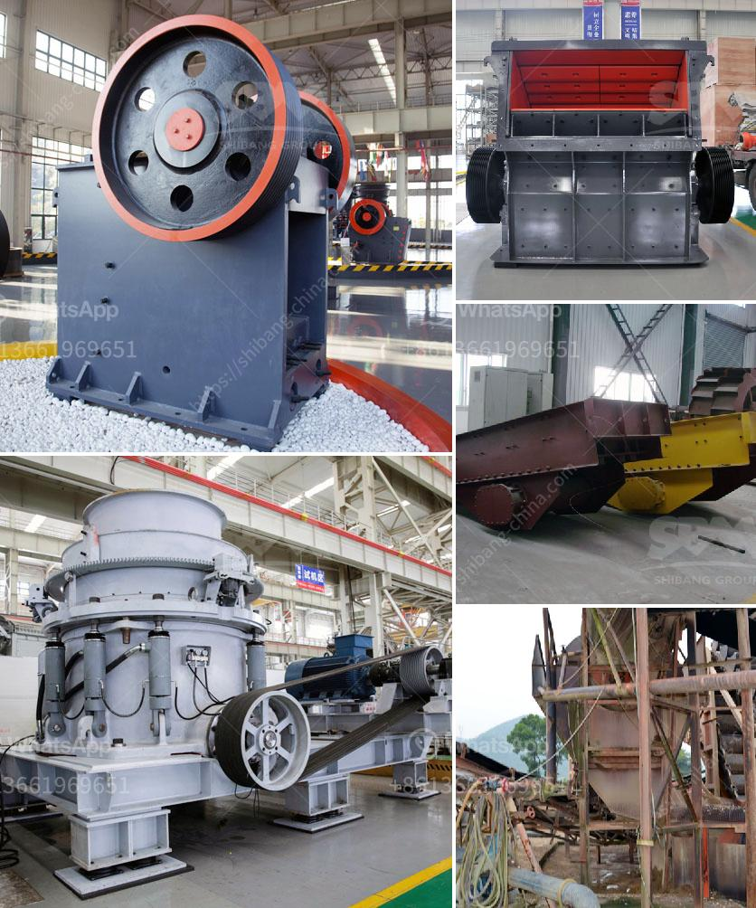

<h3>basalt crushing plant</h3>
Basalt is a commonly used natural stone in construction. It is a black or gray volcanic rock that is often used in road surfacing, concrete production, and erosion control. Basalt is also a key ingredient in asphalt, making it a versatile material widely used in the construction industry.

To meet the increasing demand for basalt, a portable basalt crushing plant is being developed. The plant consists of a crushing system that can crush basalt up to 450 tons per hour. The plant utilizes cutting-edge technology and equipment to minimize environmental impact, while producing high-quality materials for construction projects.

One of the key features of the basalt crushing plant is its mobility, which ensures that it can be easily transported to different locations. This allows for cost-effective utilization of the plant in various construction projects, regardless of their distance from the source of basalt.

The crushing system of the plant is designed to work efficiently and uniformly to ensure the production of high-quality crushed basalt. The system includes a vibrating feeder, jaw crusher, cone crusher, vibrating screen, and belt conveyors. The feeding system ensures the uniform and continuous feeding of the basalt to the jaw crusher for primary crushing. The crushed basalt is then transported by belt conveyors to the secondary cone crusher for further crushing.

The cone crusher is capable of producing high-quality materials with excellent shape and size distribution. It is equipped with an automatic control system that continuously monitors and adjusts the crushing process to optimize the performance of the plant. This ensures the consistent production of high-quality crushed basalt.

The vibrating screen separates the crushed basalt into different sizes based on customer requirements. The screened basalt is then transported by belt conveyors to different stockpiles for storage or to construction sites directly. This efficient screening process ensures the production of consistent and uniform materials for various construction applications.

The basalt crushing plant is also environmentally friendly. It is equipped with dust suppression systems that minimize dust emissions, ensuring a safe working environment for operators and nearby communities. The plant also utilizes energy-efficient equipment that minimizes energy consumption and reduces the carbon footprint.

In conclusion, the basalt crushing plant is an efficient and environmentally friendly solution for construction companies and contractors. It provides a reliable supply of high-quality crushed basalt, which is essential for various construction projects. With its mobility, the plant can be easily transported to different locations, ensuring cost-effective utilization. Overall, the basalt crushing plant is a valuable addition to the construction industry, addressing the increasing demand for basalt in a sustainable and efficient manner.
<h3>Contact us</h3><ul><li><strong>Whatsapp:&nbsp;<a href="https://wa.me/8613661969651">+8613661969651</a></strong></li><li><a href="https://swt.shibang-china.com/?git&amp;zhl&amp;basalt crushing plant"><strong>Online Service(chat now)</strong></a></li></ul><h3>Related</h3><ul><li><a href='granite stone processing plant.md'>granite stone processing plant</a></li><li><a href='cement grinding mill manufacturer india.md'>cement grinding mill manufacturer india</a></li><li><a href='pe 400 jaw crusher.md'>pe 400 jaw crusher</a></li><li><a href='rock crusher machine agent in malaysia.md'>rock crusher machine agent in malaysia</a></li><li><a href='gold crusher for sale.md'>gold crusher for sale</a></li></ul>