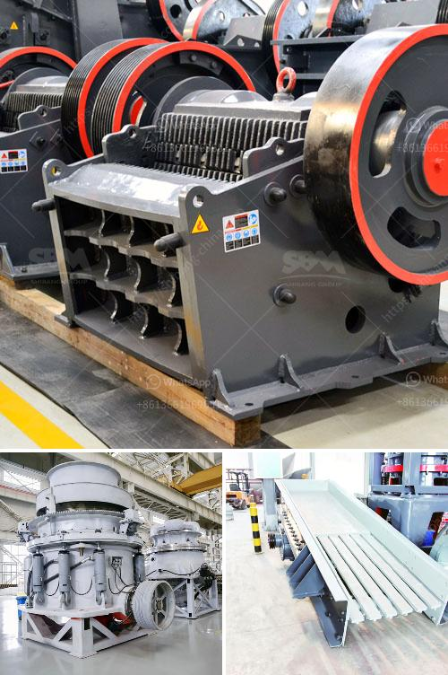

<h3>basalt mobile crusher price price</h3>
Basalt is a kind of hard and tough material with high silica content. It is usually crushed and used as a paving material or in construction projects. In recent years, with the increasing demand for highways, railways, and other infrastructure construction, the demand for basalt aggregates has surged, driving the development of the basalt mobile crusher industry.

The basalt mobile crusher, also known as a mobile crushing station, is similar to a movable crusher in that it is a complete crushing unit which processes raw materials into required sizes for further use. However, this mobile crusher has its advantages over the stationary crushing plant. The mobile crusher can be operated independently or jointly with other devices according to rough and fine crushing requirements. The plant can also be customized to meet the specific needs of customers.

When it comes to the price of the basalt mobile crusher, it is not only related to the model of the equipment but also influenced by the raw materials, transportation costs, and exchange rates. The basalt mobile crusher price varies from tens of thousands to hundreds of thousands. Some users may wonder why the crusher equipment with similar specifications and model numbers have different prices. This can be attributed to the brand reputation, quality, after-sales service, and other factors.

Compared with other crushing equipment, the basalt mobile crusher has higher flexibility and mobility, making it more convenient to transfer and install. The compact structure and easy operation are also attractive features of the mobile crusher. With the continuous development of technology, the performance of the basalt mobile crusher has been greatly improved, enhancing its crushing efficiency and reducing operating costs.

In conclusion, the basalt mobile crusher price is influenced by various factors, and customers should consider their needs and budget before making a purchase decision. It is advisable to choose a reliable manufacturer with a good reputation and comprehensive after-sales service. By doing so, customers can ensure the long-term and efficient operation of their basalt mobile crusher.
<h3>Contact us</h3><ul><li><strong>Whatsapp:&nbsp;<a href="https://wa.me/8613661969651">+8613661969651</a></strong></li><li><a href="https://swt.shibang-china.com/?git&amp;zhl&amp;basalt mobile crusher price price"><strong>Online Service(chat now)</strong></a></li></ul><h3>Related</h3><ul><li><a href='conveyor belt manufacturers bangladesh.md'>conveyor belt manufacturers bangladesh</a></li><li><a href='dolomite processing plant.md'>dolomite processing plant</a></li><li><a href='crusher machine philippine distributor and price.md'>crusher machine philippine distributor and price</a></li><li><a href='coltan processing plant prices.md'>coltan processing plant prices</a></li><li><a href='jaw crusher for sale in malaysia.md'>jaw crusher for sale in malaysia</a></li></ul>