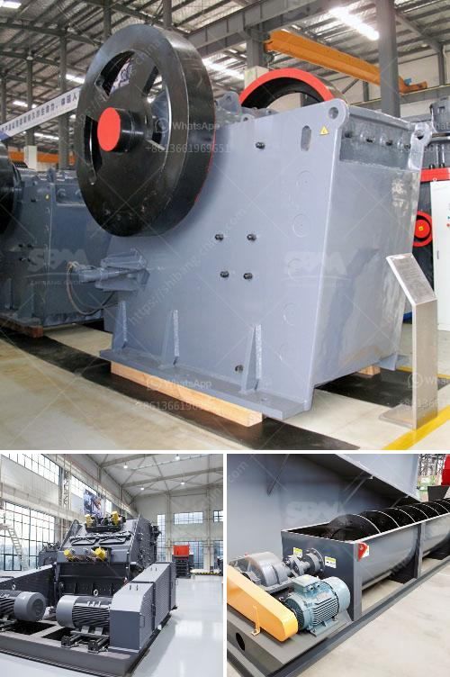

<h3>basalt production machinery</h3>
In recent years, the demand for sustainable and durable building materials has skyrocketed. As a result, architects and contractors are turning to basalt production machinery as a groundbreaking solution. Basalt, a common volcanic rock, provides exceptional strength and resilience, making it an ideal material for various construction applications. With advanced machinery and technologies, the production of basalt is revolutionizing the construction industry and paving the way for a more resilient and sustainable future.

Basalt production machinery encompasses a wide range of equipment designed to extract, refine, and shape basalt into usable materials. The process begins with the extraction of raw basalt from carefully selected quarries. Modern machinery, such as drilling rigs and high-capacity crushers, ensures efficient and sustainable extraction methods. This machinery minimizes energy consumption and reduces the environmental impact of quarrying operations.

Once the basalt is extracted, it undergoes a series of refining processes to transform it into various construction materials. Basalt production machinery provides advanced techniques for milling, shaping, and finishing basalt rocks. Cutting-edge technologies, such as laser-cutting and waterjet systems, ensure precision and quality in the production process. These machines can create intricate designs and shapes, making basalt an attractive choice for both structural and decorative purposes.

One of the most significant advantages of basalt production machinery is the sustainability it brings to the construction industry. Basalt is an abundant resource, with vast deposits found in various parts of the world. Its extraction and refinement processes have minimal environmental impact when compared to other materials like concrete or steel. Additionally, basalt has a significantly lower carbon footprint since its production does not involve the emission of harmful greenhouse gases. By using basalt production machinery, the construction industry can reduce its environmental footprint and contribute to a more sustainable future.

Furthermore, basalt's exceptional strength and durability make it an excellent alternative to traditional building materials. Due to its composition, basalt withstands extreme temperatures and can resist fire, making it an ideal material for structures in disaster-prone areas. Basalt production machinery ensures the creation of high-quality basalt products that exhibit impressive compressive strength and dimensional stability. As a result, buildings and infrastructure made from basalt can withstand harsh weather conditions, reducing the need for costly repairs and replacements.

The versatility of basalt production machinery allows for a wide array of construction applications. Basalt can be used for the production of structural elements such as beams, columns, and reinforcement bars. It is also used in the manufacturing of durable and visually appealing cladding materials, tiles, and paving stones. Basalt production machinery enables the creation of custom-made and precast basalt components for both indoor and outdoor applications.

In conclusion, basalt production machinery is transforming the construction industry by providing sustainable and durable building materials. This machinery enables the extraction, refinement, and shaping of basalt into various construction products. With its low environmental impact and exceptional strength, basalt is rapidly becoming the material of choice for architects and contractors. The use of basalt production machinery not only ensures the creation of high-quality structures but also contributes to a more sustainable and resilient future. As the demand for sustainable construction materials continues to rise, basalt production machinery will play an integral role in shaping the buildings of tomorrow.
<h3>Contact us</h3><ul><li><strong>Whatsapp:&nbsp;<a href="https://wa.me/8613661969651">+8613661969651</a></strong></li><li><a href="https://swt.shibang-china.com/?git&amp;zhl&amp;basalt production machinery"><strong>Online Service(chat now)</strong></a></li></ul><h3>Related</h3><ul><li><a href='jaw crushers 100tph.md'>jaw crushers 100tph</a></li><li><a href='stone crusher in uganda.md'>stone crusher in uganda</a></li><li><a href='mining crusher equipment.md'>mining crusher equipment</a></li><li><a href='automatic feeder for ball mill customer case.md'>automatic feeder for ball mill customer case</a></li><li><a href='stone crusher sample business plan.md'>stone crusher sample business plan</a></li></ul>