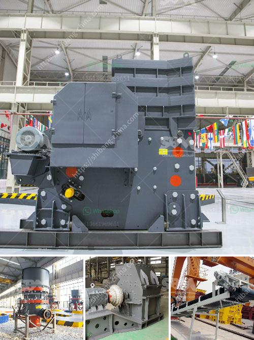

<h3>bauxite production line in germany</h3>
Bauxite, widely recognized as one of the most important aluminum-bearing minerals, is commonly found in tropical and subtropical regions, including Germany. As the country strives to achieve self-sufficiency in aluminum production, the utilization of domestic bauxite resources becomes increasingly significant. This article will explore the bauxite production line in Germany, highlighting its importance in supporting the country's industrial and environmental objectives.

Germany, being one of the prominent industrial nations in Europe, has an enormous demand for aluminum. Historically, the country relied heavily on imports to fulfill this demand, leaving it vulnerable to market fluctuations and supply disruptions. To achieve self-sufficiency and reduce dependence on imports, Germany has strategically focused on developing its bauxite production line.

Germany possesses substantial bauxite deposits, particularly in the Lusatia region of Eastern Germany. These reserves have attracted considerable attention due to their high-quality and suitability for aluminum production. Bauxite is primarily extracted from open-pit mines and then processed using various techniques to produce alumina, which serves as a precursor to aluminum.

Recognizing the importance of sustainable resource utilization, Germany has implemented stringent regulations and practices to ensure environmentally responsible bauxite mining. Strict guidelines govern land reclamation, water management, and air pollution to mitigate the environmental impact of mining operations. Additionally, mining companies are encouraged to invest in cutting-edge technologies that reduce energy consumption and minimize waste generation.

To fully harness the potential of domestic bauxite reserves, Germany has also made significant investments in advanced processing facilities. These facilities employ state-of-the-art technology and innovative techniques to refine bauxite into alumina. By optimizing the processing efficiency, Germany aims to reduce energy consumption and greenhouse gas emissions associated with alumina production.

The development of the bauxite production line in Germany not only supports the country's aluminum industry but also stimulates economic growth. The presence of domestic bauxite reserves attracts investment, creating job opportunities in mining, processing, and related industries. This drives local development and contributes to the overall economic stability of the region.

By focusing on domestic bauxite production, Germany can significantly reduce its carbon footprint and environmental impact associated with long-distance transportation. Importing bauxite from distant regions often involves substantial energy consumption and greenhouse gas emissions. Furthermore, localized production allows better control over mining practices, ensuring compliance with environmental regulations.

Germany's pursuit of self-sufficiency in aluminum production through domestic bauxite production exemplifies its commitment to sustainable resource utilization and industrial independence. The bauxite production line in Germany not only boosts economic growth and employment opportunities but also inspires innovative mining and processing practices that prioritize environmental considerations. By investing in advanced technologies and adhering to stringent environmental regulations, Germany sets an example for other nations on how to balance industrial development with sustainable practices.
<h3>Contact us</h3><ul><li><strong>Whatsapp:&nbsp;<a href="https://wa.me/8613661969651">+8613661969651</a></strong></li><li><a href="https://swt.shibang-china.com/?git&amp;zhl&amp;bauxite production line in germany"><strong>Online Service(chat now)</strong></a></li></ul><h3>Related</h3><ul><li><a href='price of mini cement plant india.md'>price of mini cement plant india</a></li><li><a href='best mobile jaw crusher 30 100tph.md'>best mobile jaw crusher 30 100tph</a></li><li><a href='stone crusher machine factory in cambodia.md'>stone crusher machine factory in cambodia</a></li><li><a href='how to increase capacity of cement ball mill.md'>how to increase capacity of cement ball mill</a></li><li><a href='quartz powder manufacturers manufacturers in china.md'>quartz powder manufacturers manufacturers in china</a></li></ul>