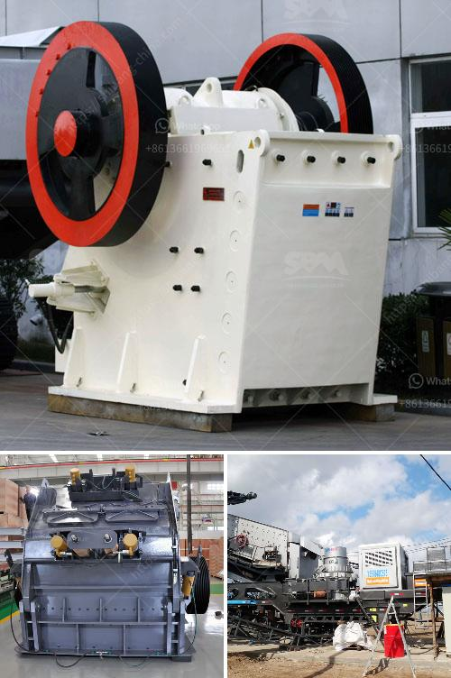

<h3>belt conveyor cost per meter of installation</h3>
Belt conveyors are an essential tool in the material handling industry. They are efficient, versatile, and cost-effective. However, when considering the cost of installing a belt conveyor system, it’s important to understand all the factors that come into play. In this article, we will discuss the cost implications of installing a belt conveyor system with a focus on its cost per meter.

The cost of a belt conveyor system can vary significantly depending on the components and design. Factors like the length of the conveyor, the complexity of the system, the types of belts used, and the desired capacity will all affect the overall cost.

One of the primary cost considerations is the length of the conveyor. Generally, longer conveyors will have higher installation costs due to the increased material and labor required. Additionally, longer conveyors may require additional supports and power transmission equipment, further adding to the overall cost. On the other hand, shorter conveyors may have higher per-meter costs due to economies of scale.

The complexity of the system is another important factor. Belt conveyors can be simple straight lines or they can include curves, inclines, or special features like sorting or diverting mechanisms. More complex systems will require additional engineering and customization, which will increase the cost per meter.

The type of belt used is also a significant cost factor. There are various types of belts available, such as PVC, rubber, or steel cord, each with different cost implications. PVC belts are generally cheaper but may have limitations in terms of load capacity and durability. On the other hand, steel cord belts are more expensive but offer higher strength and longevity, making them suitable for heavy-duty applications. The specific requirements of the application should be considered when selecting the appropriate belt type.

The desired capacity of the conveyor is crucial in determining the cost per meter. Higher capacity conveyors may require larger and more robust components, such as bigger motors, stronger frames, and additional supports. These factors will increase the overall cost of the system, resulting in a higher cost per meter.

It’s also important to consider the installation requirements and potential additional costs. Installing a belt conveyor system involves various tasks, including setting up supports, aligning the conveyor, connecting the belts, and installing the necessary electrical and control equipment. Depending on the complexity of the system, specialized labor or equipment may be required, resulting in additional costs.

In conclusion, the cost per meter of installing a belt conveyor system can vary significantly. Factors such as the length of the conveyor, the complexity of the system, the type of belt, and the desired capacity all play a role in determining the overall cost. It is essential to evaluate and plan for these factors in order to estimate an accurate cost per meter and ensure a successful and cost-effective installation.
<h3>Contact us</h3><ul><li><strong>Whatsapp:&nbsp;<a href="https://wa.me/8613661969651">+8613661969651</a></strong></li><li><a href="https://swt.shibang-china.com/?git&amp;zhl&amp;belt conveyor cost per meter of installation"><strong>Online Service(chat now)</strong></a></li></ul><h3>Related</h3><ul><li><a href='calcium carbonate ball mill process.md'>calcium carbonate ball mill process</a></li><li><a href='stone sand making machine.md'>stone sand making machine</a></li><li><a href='50tpd slag cement grinding unit cost.md'>50tpd slag cement grinding unit cost</a></li><li><a href='vertical mill size.md'>vertical mill size</a></li><li><a href='cost of tph stage crushing plant.md'>cost of tph stage crushing plant</a></li></ul>