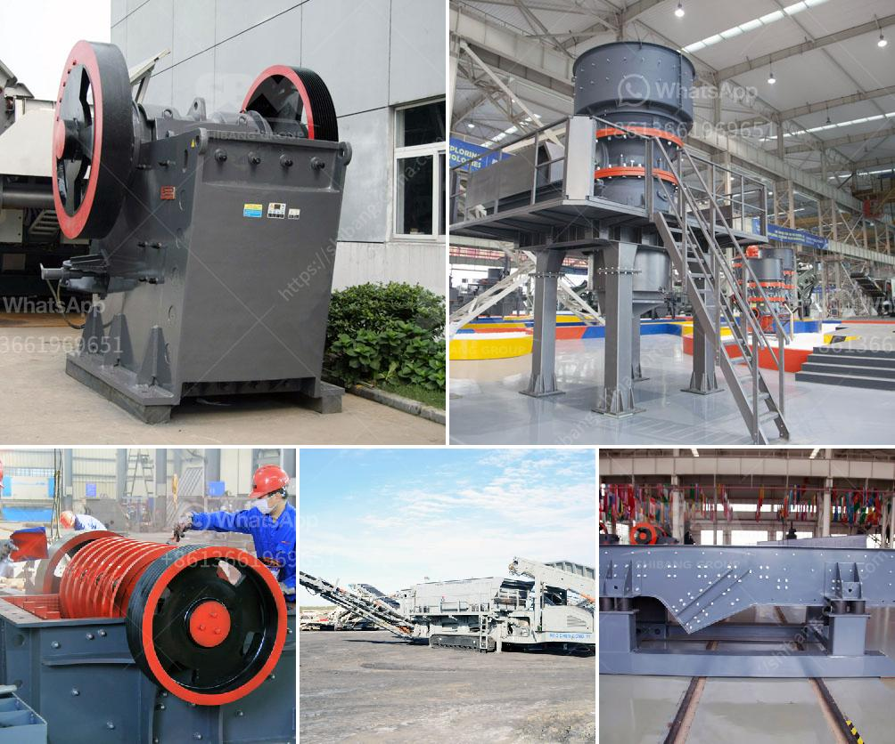

<h3>belt conveyor of cement plant technical data and price</h3>
When it comes to the transportation of bulk materials such as cement, nothing can beat the efficiency and reliability of a belt conveyor. A belt conveyor is a crucial equipment used in cement plants to efficiently transport materials from one point to another. The conveyor belt is subjected to constant wear and tear due to heavy load and the nature of the material it handles. Therefore, selecting the right conveyor belt for your cement plant is essential.

One of the critical pieces of information you need to know when considering a belt conveyor for your cement plant is its technical data. This includes the belt width, belt speed, capacity, power requirements, and other specifications. The belt width determines the amount of material that can be transported at a given time. It is essential to choose a wide enough belt to handle the desired capacity of your cement plant.

The belt speed refers to how fast the belt moves, and it directly affects the material handling capacity of the conveyor. A higher belt speed allows for a higher material throughput, but it also increases the wear and tear on the belt, reducing its lifespan. Therefore, finding the optimal balance between speed and belt longevity is crucial.

Capacity is another important factor to consider. It determines the amount of material that can be transported per hour or per day. The capacity requirement for your cement plant depends on the production volume and processing time. It is essential to choose a conveyor with sufficient capacity to meet the demands of your plant and avoid any bottlenecks in the production process.

In terms of power requirements, belt conveyors for cement plants typically run on electric motors. The power rating of the motor should be able to handle the load and provide smooth and consistent operation. It is important to choose a conveyor with an adequately sized motor to avoid any issues related to power overload or underperformance.

Apart from the technical data, the price of a belt conveyor is also a crucial factor to consider for any cement plant. The cost of a belt conveyor can vary depending on its size, capacity, and other specifications. Generally, larger and more powerful conveyors tend to be more expensive. However, it is important to strike a balance between cost and quality. It is better to invest in a high-quality conveyor that can handle the demands of your cement plant efficiently, even if it comes at a slightly higher price.

In conclusion, selecting the right belt conveyor for your cement plant requires careful consideration of its technical data, including belt width, speed, capacity, and power requirements. It is important to find a balance between these factors to ensure optimal performance and longevity. Additionally, the price of the conveyor should be taken into account, considering your budget and the quality required. Ultimately, choosing the right conveyor will contribute to the smooth operation and productivity of your cement plant.
<h3>Contact us</h3><ul><li><strong>Whatsapp:&nbsp;<a href="https://wa.me/8613661969651">+8613661969651</a></strong></li><li><a href="https://swt.shibang-china.com/?git&amp;zhl&amp;belt conveyor of cement plant technical data and price"><strong>Online Service(chat now)</strong></a></li></ul><h3>Related</h3><ul><li><a href='mini concrete crushers for sale in america.md'>mini concrete crushers for sale in america</a></li><li><a href='stone crusher philippines.md'>stone crusher philippines</a></li><li><a href='grinding units of feldspar.md'>grinding units of feldspar</a></li><li><a href='stone crushers companies in tanzania.md'>stone crushers companies in tanzania</a></li><li><a href='sand sieve machine philippines.md'>sand sieve machine philippines</a></li></ul>