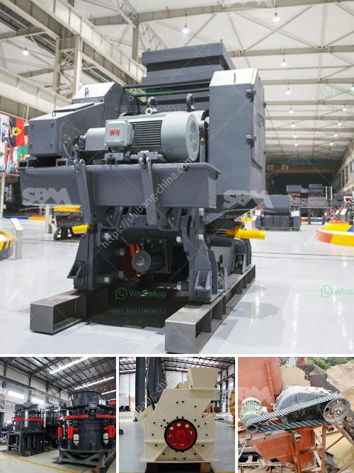

<h3>belt conveyor system manufacturers</h3>
When it comes to transporting goods and materials within a facility or from one place to another, belt conveyor systems play a crucial role in ensuring smooth and efficient operations. Belt conveyors are used in a wide range of industries such as manufacturing, distribution, warehousing, and mining, to name a few. They are designed to move heavy or bulky items, packages, or raw materials from one point to another, eliminating the need for manual handling or multiple handling processes.

To meet the diverse needs of different industries, there are numerous belt conveyor system manufacturers who specialize in designing, manufacturing, and installing conveyor systems. These manufacturers understand the unique requirements of each industry and offer customized solutions to increase efficiency and productivity. Here, we will discuss the key aspects of belt conveyor system manufacturers and how they contribute to the smooth material flow.

Customization: Belt conveyor system manufacturers offer a wide range of customization options to meet specific application requirements. They consider factors such as the type of material being handled, the distance to be covered, the overall layout of the facility, and any specific industry regulations or standards. This ensures that the conveyor system is tailored to the facility's needs and can efficiently transport materials of varying sizes and weights.

Material Handling Efficiency: Belt conveyors are designed to handle a wide range of materials, from small components to large boxes or pallets. Belt conveyor system manufacturers prioritize material handling efficiency by considering factors such as conveyor speed, belt width, load capacity, and inclination. By optimizing these parameters, they ensure that materials can be transported smoothly and without any bottlenecks, leading to increased productivity and reduced downtime.

Safety: Safety is of utmost importance in any manufacturing or material handling facility. Belt conveyor system manufacturers are aware of the potential hazards associated with conveyor systems and strive to design and manufacture systems with safety as a top priority. They adhere to industry safety standards and incorporate features such as emergency stop buttons, guards, and sensors to prevent accidents and injuries. Additionally, they provide proper training and guidelines on the safe operation and maintenance of conveyor systems.

Reliability and Maintenance: A reliable conveyor system plays a critical role in maintaining continuous material flow and preventing downtime. Belt conveyor system manufacturers focus on building robust and durable systems that can withstand heavy loads, extreme temperatures, and harsh environmental conditions. They also provide preventive maintenance programs to ensure that the conveyor system operates smoothly and any potential issues are identified and resolved before they escalate.

Future-Readiness: With advancements in technology and automation, belt conveyor system manufacturers are continuously innovating to meet the changing needs of industries. They incorporate features such as smart controls, real-time monitoring, and data analytics capabilities to optimize system performance, enhance efficiency, and enable predictive maintenance. This future-readiness ensures that the conveyor system can adapt to evolving industry requirements and support the facility's growth.

In conclusion, belt conveyor system manufacturers play a critical role in ensuring smooth material flow within facilities. By offering customized solutions, prioritizing material handling efficiency and safety, providing reliable systems, and embracing future-readiness, they contribute to increased productivity, reduced downtime, and overall operational excellence. Collaborating with a reputable belt conveyor system manufacturer is a wise investment for any industry looking to streamline their material handling processes.
<h3>Contact us</h3><ul><li><strong>Whatsapp:&nbsp;<a href="https://wa.me/8613661969651">+8613661969651</a></strong></li><li><a href="https://swt.shibang-china.com/?git&amp;zhl&amp;belt conveyor system manufacturers"><strong>Online Service(chat now)</strong></a></li></ul><h3>Related</h3><ul><li><a href='latest chrome crush and wash plant for sale in rsa.md'>latest chrome crush and wash plant for sale in rsa</a></li><li><a href='crusher stone crusher 10x 21 america.md'>crusher stone crusher 10x 21 america</a></li><li><a href='the price of a ball mill in india.md'>the price of a ball mill in india</a></li><li><a href='how to make copper concentrate.md'>how to make copper concentrate</a></li><li><a href='price of granite crusher tons per hour.md'>price of granite crusher tons per hour</a></li></ul>