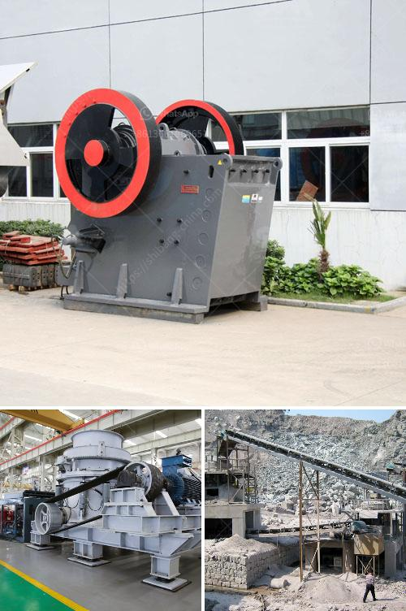

<h3>beneficiation plant for feldspar japan</h3>
Feldspar is one of the most important materials used in various industries due to its versatility and abundance. In Japan, feldspar resources are predominantly found in the northern area of the country and are mined and processed to meet the demands of both domestic and international markets. Beneficiation plants play a crucial role in efficiently extracting and processing these resources.

A beneficiation plant for feldspar in Japan primarily aims at separating quartz and feldspar minerals from impurities like muscovite, mica, and biotite. These minerals can interfere with the overall quality of the final feldspar product, reducing its commercial value. To address this issue, beneficiation plants utilize various processes including crushing, screening, and magnetic separation.

The industry-leading beneficiation plant for feldspar in Japan incorporates several highly advanced technologies. For instance, crushers and grinding mills are meticulously designed to ensure gentle and efficient particle size reduction. Additionally, screening equipment is employed to remove oversized particles while ensuring uniformity in the final product size.

Magnetic separation is another crucial step in the beneficiation process. It involves the use of magnetic separators to remove iron-bearing minerals and other magnetic impurities from the feldspar ore. This step ensures higher purity levels and enhances the value of the final product.

Beyond the technical aspects, environmental sustainability is also a key concern in the operation of a beneficiation plant for feldspar. Stringent measures are implemented to minimize water consumption, reduce energy usage, and properly manage any waste generated in the process. Japan, renowned for its commitment to resource efficiency, strictly adheres to these guidelines, ensuring that the beneficiation plant operates in an environmentally conscious manner.

In conclusion, the beneficiation plant for feldspar in Japan plays a crucial role in separating impurities from valuable minerals to produce high-quality feldspar. By utilizing advanced technologies and adhering to environmental standards, the plant ensures a sustainable supply of this versatile material to industries both domestically and internationally. As the demand for feldspar continues to rise, the role of beneficiation plants becomes increasingly vital in maintaining a reliable and efficient supply chain.
<h3>Contact us</h3><ul><li><strong>Whatsapp:&nbsp;<a href="https://wa.me/8613661969651">+8613661969651</a></strong></li><li><a href="https://swt.shibang-china.com/?git&amp;zhl&amp;beneficiation plant for feldspar japan"><strong>Online Service(chat now)</strong></a></li></ul><h3>Related</h3><ul><li><a href='crushers mobile crushers american mobile.md'>crushers mobile crushers american mobile</a></li><li><a href='granite stone crusher india.md'>granite stone crusher india</a></li><li><a href='mineral processing equipment cost.md'>mineral processing equipment cost</a></li><li><a href='crusher stone crusher 10x20.md'>crusher stone crusher 10x20</a></li><li><a href='sand mining equipment manufacturer in south africa.md'>sand mining equipment manufacturer in south africa</a></li></ul>