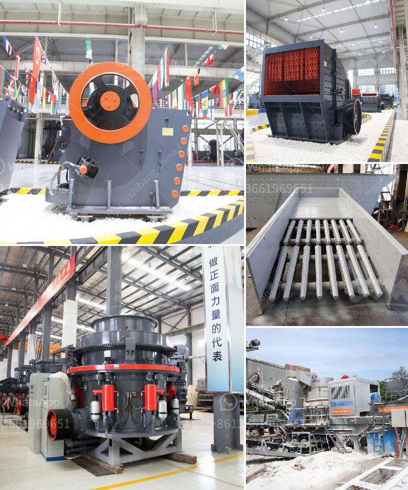

<h3>bentonite crusher grinding mill mobile</h3>
Bentonite is a clay mineral that is primarily composed of hydrated calcium aluminum silicate. It has incredible properties that make it suitable for a wide range of applications. One of its main uses is in the construction industry, where it is used as a binder in cement and concrete. However, bentonite also has various other industrial applications, including in the oil and gas industry, agriculture, and pharmaceuticals.

To make the best use of bentonite, it is important to crush and grind it into suitable particles that can be further processed. To achieve this, a bentonite crusher and grinding mill are the necessary equipment. For the grinding stage, the bentonite needs to be separated into different sizes. To facilitate this process, various types of grinding machines are used, including the Raymond mill, high-pressure grinding mill, and micro grinding mill.

Mobile crushers are also used in the bentonite quarrying. For a long time, mobile crushers have been playing an important role in various construction projects, as they allow for easy transportation and flexibility. These machines are designed to crush and grind bentonite ore into desired sizes, making it easier to process further. Additionally, mobile crushers can be quickly set up and dismantled, allowing for efficient operations in various locations.

The bentonite crusher and grinding mill produced by Liming Heavy Industry are characterized by their high efficiency, low energy consumption, and ease of operation. We can provide customers with various bentonite crushers, such as jaw crusher, impact crusher, cone crusher, and mobile crusher. These crushing machines can satisfy different production requirements.

In addition to crushers, we also provide customers with grinding mills, which can grind bentonite into different sizes. The Raymond mill, high-pressure grinding mill, and micro grinding mill are all available for customers to choose from. These mills have high capacity, low energy consumption, and are environmentally friendly.

Moreover, our mobile crushers and grinding mills are equipped with advanced technology and intelligent control systems, ensuring smooth and efficient operations. They are designed to provide customers with high-quality finished products. Additionally, our machines are made of high-quality materials, ensuring their durability and long service life.

In conclusion, bentonite crusher and grinding mill are essential equipment for bentonite processing. Mobile crushers and grinding mills provided by Liming Heavy Industry are specially designed for bentonite processing, aiming to help customers achieve efficient and high-quality production. Whether it is for construction, oil and gas, agriculture, or pharmaceuticals, these machines are capable of meeting various industrial needs. With advanced technology and intelligent control systems, our machines are sure to satisfy customers and contribute to their success in the industry.
<h3>Contact us</h3><ul><li><strong>Whatsapp:&nbsp;<a href="https://wa.me/8613661969651">+8613661969651</a></strong></li><li><a href="https://swt.shibang-china.com/?git&amp;zhl&amp;bentonite crusher grinding mill mobile"><strong>Online Service(chat now)</strong></a></li></ul><h3>Related</h3><ul><li><a href='used primary crushers for sale.md'>used primary crushers for sale</a></li><li><a href='screen and crusher hire.md'>screen and crusher hire</a></li><li><a href='stone crusher price in ethiopia.md'>stone crusher price in ethiopia</a></li><li><a href='calcium carbonate mines in pakistan.md'>calcium carbonate mines in pakistan</a></li><li><a href='used stone crushers in south korea.md'>used stone crushers in south korea</a></li></ul>