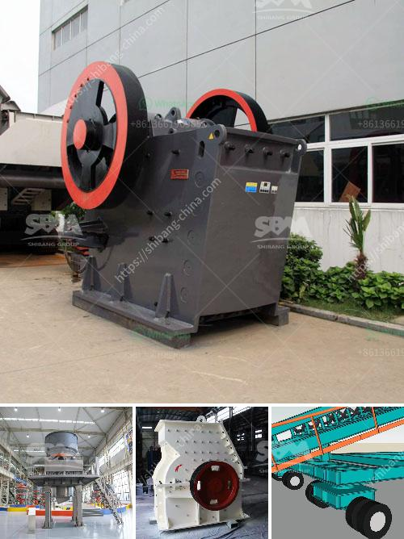

<h3>bentonite crushing machine</h3>
Bentonite is a unique and versatile mineral that is mainly composed of montmorillonite, which is the predominant element responsible for its properties. Bentonite is commonly used for foundry, drilling, construction, and civil engineering applications due to its ability to swell and gel when properly hydrated.

Crushing is an essential part of the mining process. Once the bentonite is extracted, it is first crushed into smaller particles to facilitate the further processing. In order to get consistent particle sizes and optimize the performance of the subsequent processes, it is crucial to have a reliable and efficient crushing machine.

The primary goal of the bentonite crushing machine is to reduce the size of the raw materials so that they can be further processed into finer particles in the subsequent grinding process. The crushing machine is designed to produce a uniform particle size, which allows for optimum performance in the final product.

There are various types of crushing machines available for the bentonite processing. They include jaw crusher, impact crusher, cone crusher, and mobile crusher. Among these, jaw crusher is the most commonly used one, mainly because it is easy to operate and convenient to maintain.

The jaw crusher has a simple structure, consisting of a fixed jaw and a swing jaw. The material is fed into the crushing chamber through an eccentric shaft, which ensures a constant downward movement of the swing jaw. As the material is crushed, it falls down into the discharge opening, where it is collected and further processed.

When selecting a crushing machine for bentonite, it is essential to consider factors such as the hardness and brittleness of the material, the desired output size, and the capacity requirements. Additionally, one should also take into account the maintenance requirements, energy consumption, and overall cost-effectiveness of the machine.

In recent years, advancements in technology have led to the development of more efficient and innovative crushing machines. These machines are equipped with features such as hydraulic systems, which enable easy adjustment of the crushing gap and overload protection. Moreover, they also have variable speed control, allowing the operator to optimize the crushing process based on the material properties.

Furthermore, some crushing machines come with advanced automation features, which ensure a consistent and reliable operation. This not only improves the overall efficiency but also reduces the risk of human error. Additionally, remote monitoring capabilities enable operators to monitor the machine's performance and make necessary adjustments remotely.

In conclusion, the bentonite crushing machine plays a crucial role in the processing of bentonite. It is designed to reduce the size of the raw materials so that they can be further processed into finer particles. The selection of the right crushing machine is essential to ensure a reliable and efficient operation. With advancements in technology, there are now more efficient and innovative crushing machines available, making the process easier and more cost-effective.
<h3>Contact us</h3><ul><li><strong>Whatsapp:&nbsp;<a href="https://wa.me/8613661969651">+8613661969651</a></strong></li><li><a href="https://swt.shibang-china.com/?git&amp;zhl&amp;bentonite crushing machine"><strong>Online Service(chat now)</strong></a></li></ul><h3>Related</h3><ul><li><a href='cement clinker grinding plant in india.md'>cement clinker grinding plant in india</a></li><li><a href='stone portable crusher.md'>stone portable crusher</a></li><li><a href='sliding shoe bearing ball mill skf.md'>sliding shoe bearing ball mill skf</a></li><li><a href='used calcite powder plant and machinery.md'>used calcite powder plant and machinery</a></li><li><a href='sand and gravel separation machine.md'>sand and gravel separation machine</a></li></ul>