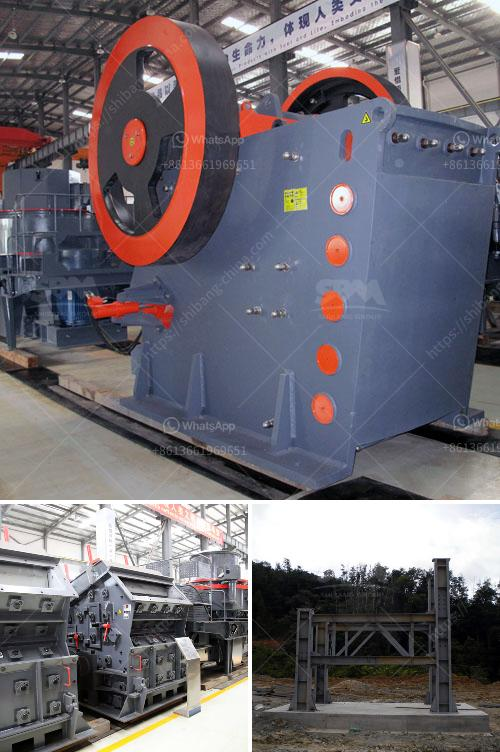

<h3>bentonite grinding machines price</h3>
Bentonite is a type of clay used in various industries for its different properties. One key application is in the production of drilling fluid, where it is added to the mixture to increase its viscosity and prevent water migration. Bentonite grinding machines are widely used in the industrial processing of bentonite.

The price of bentonite grinding machines varies greatly due to the different types of models, the output of the equipment, and the configuration of the production line. However, the price of bentonite grinding machines generally ranges from hundreds of thousands to millions of dollars.

The bentonite grinding machine mainly consists of a main engine, a grinding system, an analysis system, a pipeline device, a feeder, a dust collector, an electric control system, and other components. The grinding chamber is equipped with a distributing plate, a blade, and a grinding roller. The material is scattered to the periphery under the action of centrifugal force, and it falls into the grinding chamber for pulverization. The ground material is blown into the analysis machine for sorting according to the fineness, and the coarse particles are returned to the grinding chamber for re-grinding.

When purchasing bentonite grinding machines, it is important to consider not only the price but also the quality and after-sales service. Reliable manufacturers and suppliers will provide comprehensive solutions, technical support, and installation guidance. Additionally, they will offer regular equipment maintenance and repair services, ensuring the optimal operation and prolonging the lifespan of the equipment.

In conclusion, the price of bentonite grinding machines can vary depending on the specific model, output, and configuration required by the customer. It is essential to choose a reputable manufacturer or supplier that can provide high-quality equipment and reliable after-sales service. Investing in a reliable bentonite grinding machine can greatly improve production efficiency and contribute to the success of various industries that use this versatile clay material.
<h3>Contact us</h3><ul><li><strong>Whatsapp:&nbsp;<a href="https://wa.me/8613661969651">+8613661969651</a></strong></li><li><a href="https://swt.shibang-china.com/?git&amp;zhl&amp;bentonite grinding machines price"><strong>Online Service(chat now)</strong></a></li></ul><h3>Related</h3><ul><li><a href='stone sand making machine.md'>stone sand making machine</a></li><li><a href='trackmounted crushing.md'>track-mounted crushing</a></li><li><a href='grinding plant supplier.md'>grinding plant supplier</a></li><li><a href='gold mining machine indonesia equipment nigeria.md'>gold mining machine indonesia equipment nigeria</a></li><li><a href='rock quarry crusher machinery.md'>rock quarry crusher machinery</a></li></ul>