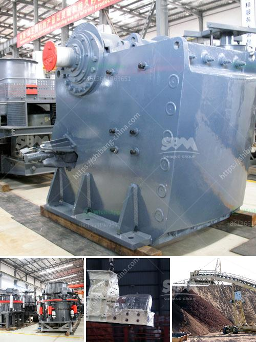

<h3>bentonite production plant machinery</h3>
Bentonite is a versatile mineral that is widely used in various industries, including agriculture, construction, and wastewater treatment. It is formed from volcanic ash deposits and consists mainly of montmorillonite, a clay mineral. One crucial aspect of bentonite production is the machinery used to mine and process it.

A bentonite production plant requires heavy machinery such as excavators, conveyors, and crushers to extract and transport the mineral to the processing facility. These machines make mining efficient and cost-effective, minimizing manual labor and reducing production time. 

Excavators are the primary machines used to extract bentonite from the earth. These large hydraulic machines have a bucket attached to the boom that can dig deep into the ground to reach the bentonite deposits. Once the excavators remove the raw material, it is transported to the processing plant using conveyor belts or trucks.

At the processing plant, crushers break down the mined bentonite into smaller fragments, ensuring it is suitable for various applications. It is essential to optimize the crushing process to obtain the desired particle size and quality of bentonite. Depending on the end use, additional machinery such as dryers, pulverizers, or mixers may be employed to further process the bentonite.

Additionally, specialized machinery is used to control the moisture content and granulation of the bentonite during the processing stage. This helps in achieving the desired characteristics and ensuring the bentonite meets the specific requirements of different industries.

Moreover, bentonite production plants often incorporate advanced technologies to improve efficiency and reduce environmental impact. Dust collection systems are installed to minimize airborne particles during crushing and processing. Water recycling systems are implemented to conserve resources and reduce wastewater discharge.

In conclusion, the machinery used in a bentonite production plant plays a crucial role in mining, processing, and preparing this versatile mineral for various applications. The use of modern and efficient machines ensures higher productivity, cost-effectiveness, and environmental sustainability in the production process.
<h3>Contact us</h3><ul><li><strong>Whatsapp:&nbsp;<a href="https://wa.me/8613661969651">+8613661969651</a></strong></li><li><a href="https://swt.shibang-china.com/?git&amp;zhl&amp;bentonite production plant machinery"><strong>Online Service(chat now)</strong></a></li></ul><h3>Related</h3><ul><li><a href='50tpd slag cement grinding unit cost.md'>50tpd slag cement grinding unit cost</a></li><li><a href='bentonite production plant machinery.md'>bentonite production plant machinery</a></li><li><a href='dry processing machine supplier.md'>dry processing machine supplier</a></li><li><a href='how much cost to build a 50 ton cement plant.md'>how much cost to build a 50 ton cement plant</a></li><li><a href='low speed crusher suppliers in china.md'>low speed crusher suppliers in china</a></li></ul>