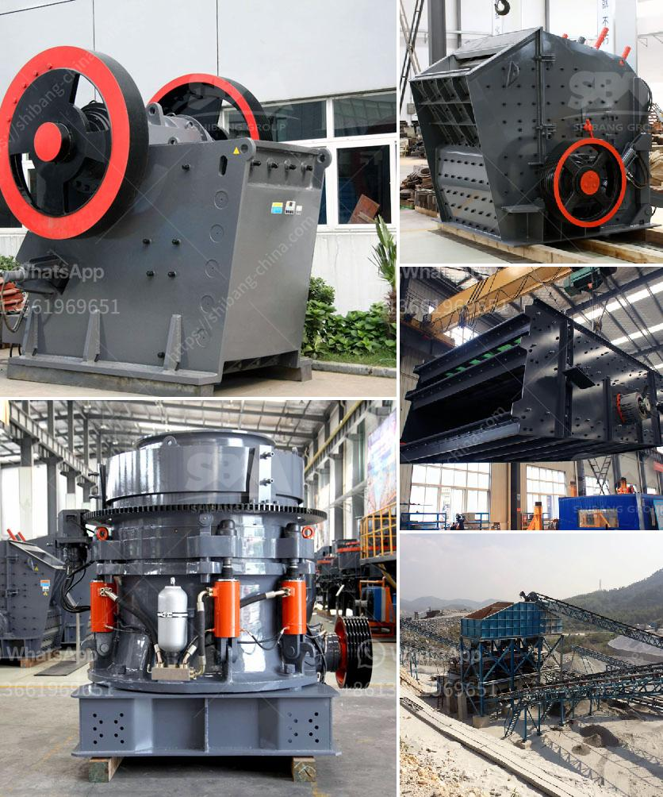

<h3>best crusher crushing mm coal of feed size mm</h3>
When it comes to coal crushing, size matters. The best crusher crushing 8mm coal of feed size 20mm can narrow down the choice between equipment and productivity in coal mining. Understanding the feed parameters, impact crushers produce a uniformed cubicle product with uniform plate structure, while cone crushers produce a finer aggregate product. Crushers with the capability to crush to this small of a size are ideal for breaking down coal into small particles for further processing.

The first step in the crushing process is to reduce the size of the coal to manageable chunks. For this purpose, the best crusher for coal crushing is typically a jaw crusher. Jaw crushers offer a wider range of potential output sizes than impact crushers or cone crushers, as they are best for medium-hard to very hard materials. Jaw crushers are also more versatile with a wide range of feed sizes, making them perfectly suited to the task at hand.

For the best crusher crushing 8mm coal of feed size 20mm, one crusher stands out above the rest: the cone crusher. Not only does it excel at crushing larger and harder rocks, but it is also efficient in crushing finer particles as well. The cone crusher utilizes compression force to break particles and can be adjusted to achieve different sizes of crushed material. Additionally, it offers high production capacity, low operating costs, and easy maintenance, making it a top choice for coal crushing.

In terms of equipment, it is important to choose a cone crusher that is specifically designed for coal crushing. These crushers are equipped with features such as reinforced body construction, anti-wear components, and advanced automation systems for optimal performance and durability. Furthermore, the crusher should have a closed-circuit design to efficiently control the particle size distribution and minimize the chance of coal dust leakage during the crushing process. Safety should always be a priority.

Another factor to consider when selecting a crusher for coal crushing is the power requirements. The crusher should be able to handle the specific coal properties, such as hardness, size distribution, and friability, while operating within the designated power range. It is recommended to consult with experts or manufacturers to ensure the crusher's power specifications align with the coal characteristics.

In conclusion, selecting the best crusher for crushing 8mm coal with a feed size of 20mm plays a crucial role in maximizing productivity and efficiency in coal mining operations. Jaw crushers are ideal for reducing the size of the coal to manageable chunks, while cone crushers excel at crushing both larger and finer particles. It is essential to choose a cone crusher specifically designed for coal crushing, considering factors such as equipment features, power requirements, and safety measures. With the right crusher, coal miners can effectively process coal, ensuring a smooth operation and high-quality end products.
<h3>Contact us</h3><ul><li><strong>Whatsapp:&nbsp;<a href="https://wa.me/8613661969651">+8613661969651</a></strong></li><li><a href="https://swt.shibang-china.com/?git&amp;zhl&amp;best crusher crushing mm coal of feed size mm"><strong>Online Service(chat now)</strong></a></li></ul><h3>Related</h3><ul><li><a href='hammer mills for sale in south africa.md'>hammer mills for sale in south africa</a></li><li><a href='dolomite stone crusher manufacturers.md'>dolomite stone crusher manufacturers</a></li><li><a href='desain hammer mill dengan pelat rotor pdf.md'>desain hammer mill dengan pelat rotor pdf</a></li><li><a href='south africa jaw crushers.md'>south africa jaw crushers</a></li><li><a href='price of grinding mills in uganda.md'>price of grinding mills in uganda</a></li></ul>