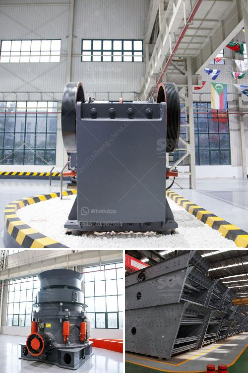

<h3>best mobile jaw crusher 30 100tph</h3>
The mobile jaw crusher market has experienced significant growth in recent years. This versatile, compact, and easy-to-use equipment has revolutionized crushing operations on construction sites, mining sites, and recycling applications. With a multitude of options currently available, choosing the best mobile jaw crusher for your specific needs can be challenging. In this article, we will explore the top 30-100tph mobile jaw crushers on the market.

One of the leading jaw crusher models in this category is the Sandvik QJ341. This powerful machine possesses a jaw opening of 1200 x 750mm (48 x 30 inches) and is capable of producing up to 300 tons per hour of high-quality product. The large feed opening allows for excellent reduction ratios, making it suitable for a variety of applications, including quarrying, recycling, and demolition.

Another highly regarded option is the Metso Lokotrack LT106. This robust unit features a fuel-efficient engine and a hydraulic drive to ensure consistent performance even in the most demanding conditions. With a capacity of up to 400 tons per hour, the LT106 is ideal for medium to large-scale operations. Its compact size and easy transportability make it suitable for both tight urban environments and remote sites.

For those looking for a more budget-friendly option, the Keestrack B3 jaw crusher is worth considering. Despite its affordability, the B3 doesn't compromise on quality or performance. It boasts a powerful engine, a large feed opening, and a high crushing capacity of up to 300 tons per hour. Additionally, its user-friendly design and intuitive controls make it simple to operate and maintain.

Cedarapids CRJ3750 is another notable mobile jaw crusher in the 30-100tph range. Equipped with a 50 x 38-inch jaw chamber, it delivers superior crushing performance. The CRJ3750 showcases easy maintenance features, including a hydraulically adjustable jaw setting and a fully hydraulic wedge system for quick and easy liner changes. With its high productivity and reliability, it is an ideal choice for various demanding applications.

Lastly, the Terex Finlay J-1175 is an excellent option for those seeking a reliable, mobile jaw crusher. With a jaw chamber size of 1070 x 762mm (42 x 30 inches) and a capacity of up to 475 tons per hour, it provides exceptional productivity. Its robust construction and user-friendly features ensure long-lasting performance and ease of operation.

In conclusion, when it comes to choosing the best mobile jaw crusher in the 30-100tph range, several options stand out. The Sandvik QJ341, Metso Lokotrack LT106, Keestrack B3, Cedarapids CRJ3750, and Terex Finlay J-1175 all offer impressive capabilities and performance. Ultimately, the right choice depends on your specific application requirements and budget. It is always advisable to consult with a trusted equipment provider to determine the most suitable model for your needs.
<h3>Contact us</h3><ul><li><strong>Whatsapp:&nbsp;<a href="https://wa.me/8613661969651">+8613661969651</a></strong></li><li><a href="https://swt.shibang-china.com/?git&amp;zhl&amp;best mobile jaw crusher 30 100tph"><strong>Online Service(chat now)</strong></a></li></ul><h3>Related</h3><ul><li><a href='gypsum powder production line factory.md'>gypsum powder production line factory</a></li><li><a href='crusher prices of mobile crusher in bolivia.md'>crusher prices of mobile crusher in bolivia</a></li><li><a href='coltan processing plant prices.md'>coltan processing plant prices</a></li><li><a href='course sand manufacturers in india.md'>course sand manufacturers in india</a></li><li><a href='gypsum powder making machine pdf.md'>gypsum powder making machine pdf</a></li></ul>