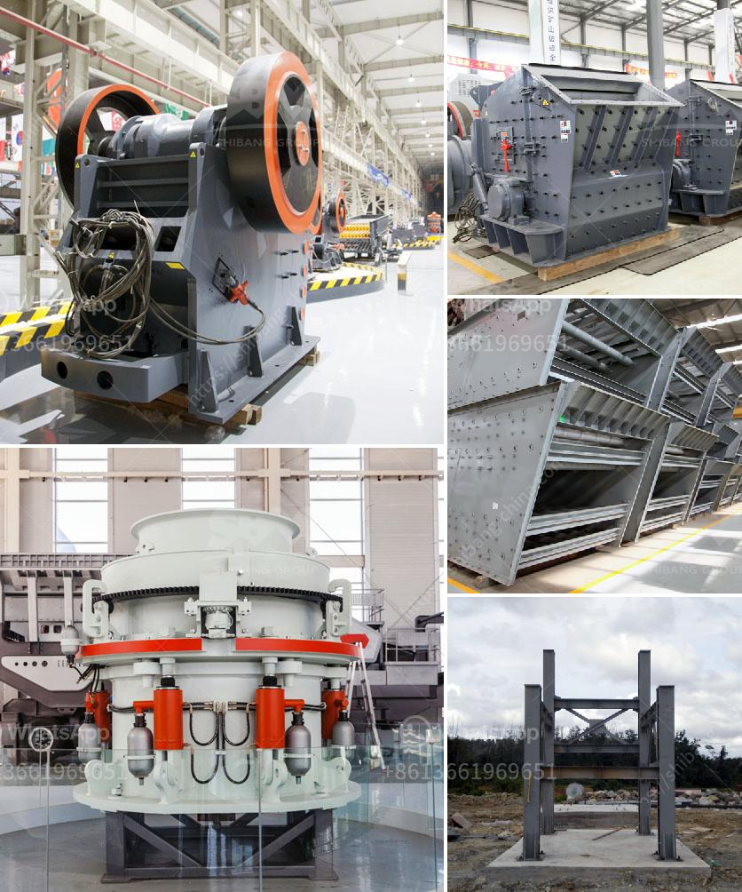

<h3>best stone crushers india</h3>
India, an emerging economy, boasts a diverse range of industries and manufacturing units. The stone crushing sector has witnessed immense growth in the past few years. The growth of the stone crushers in India has been increased rapidly due to the booming infrastructure projects in India.

In India, the stone crushing industry sector is estimated to have an annual turnover of Rs. 5000 crore. It is considered to be one of the most polluting industries, as it contributes significantly to the air pollution and water pollution levels in the country.

However, the stone crushing industry also plays a vital role in the Indian economy by providing employment opportunities to thousands of people, both in rural and urban areas. It has become an important part of the construction industry, supplying materials for various construction projects such as roads, highways, bridges, buildings, and dams.

1. Metso India Pvt Ltd: Metso India is one of the largest manufacturers of stone crushing equipment in India. For over two decades, the company has been providing equipment and services to the global mining and construction industry. They specialize in offering stone crushers, screens, feeders, and scalpers to meet the most challenging requirements from contractors, mines, and quarries.

2. Propel Industries Pvt Ltd: Propel Industries is a leading manufacturer of various machinery and equipment used in the stone crushing industry. They provide a comprehensive range of products such as jaw crushers, cone crushers, vibrating screens, sand washers, and various other stone crushing accessories. With their state-of-the-art manufacturing facilities and dedication to customer satisfaction, Propel Industries has earned a reputable position in the Indian market.

3. Larsen & Toubro Limited (L&T): L&T is one of the largest infrastructure companies in India, involved in the construction of major projects across various sectors. Their construction equipment division manufactures and sells stone crushers to cater to the growing demand in the country. L&T's stone crushers are known for their robust construction, reliability, and excellent performance even in the harshest conditions.

4. Thyssenkrupp Industries India Pvt Ltd: Thyssenkrupp Industries India is a part of the global conglomerate Thyssenkrupp AG. They offer various solutions for the mining and construction industry, including stone crushers. Their crushers are designed to deliver high productivity, low operating costs, and exceptional durability. Thyssenkrupp's stone crushers are known for their superior engineering and cutting-edge technology.

The stone crushing industry in India has witnessed tremendous growth due to the increasing infrastructure projects in the country. Multiple stone crushers are available to cater to the growing demand for high-quality aggregates and materials. Companies such as Metso India Pvt Ltd, Propel Industries Pvt Ltd, Larsen & Toubro Limited, and Thyssenkrupp Industries India Pvt Ltd are some of the top manufacturers of stone crushers in India.

Investing in high-quality stone crushers not only ensures efficient crushing operations but also contributes to environmental sustainability by minimizing pollution levels. These companies' commitment to cutting-edge technology, robust construction, and customer satisfaction makes them the best options for stone crushing equipment in India.
<h3>Contact us</h3><ul><li><strong>Whatsapp:&nbsp;<a href="https://wa.me/8613661969651">+8613661969651</a></strong></li><li><a href="https://swt.shibang-china.com/?git&amp;zhl&amp;best stone crushers india"><strong>Online Service(chat now)</strong></a></li></ul><h3>Related</h3><ul><li><a href='cement formation process.md'>cement formation process</a></li><li><a href='ball mills used in peru.md'>ball mills used in peru</a></li><li><a href='stone crushing plant project report doc.md'>stone crushing plant project report doc</a></li><li><a href='coal mining equipment for sale.md'>coal mining equipment for sale</a></li><li><a href='coal mining process machinery.md'>coal mining process machinery</a></li></ul>