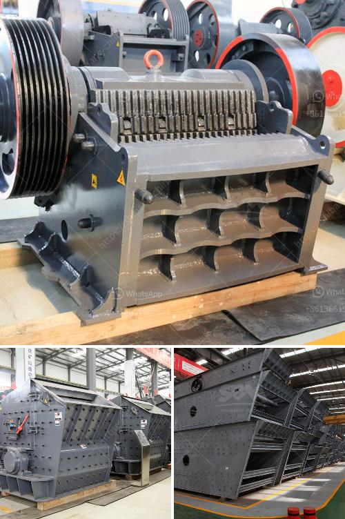

<h3>big crushing machine</h3>
Crushing machines have revolutionized various sectors, ranging from mining to recycling. Among these machines, the big crushing machine stands out as a game-changer due to its immense size and ability to crush substantial quantities of materials efficiently. In this article, we will delve into the features, applications, and benefits of this colossal crushing machine.

The big crushing machine, which is usually stationary and designed for heavy-duty purposes, is primarily composed of a large jaw, cone, or impact crusher. These machines are capable of crushing multiple materials, including ores, rocks, concrete, asphalt, and demolition debris. 

The working mechanism of the big crushing machine involves a motor-driven belt and pulley system that exerts force on the material, breaking it into smaller, manageable sizes. The large size of these machines enables them to handle significant quantities of material, reducing the need for multiple smaller crushers.

Various industries benefit from the big crushing machine, including mining, construction, quarrying, and recycling. This crushing equipment can process different types of materials, such as limestone for road construction, granite for building facades, or recycled concrete for use in new construction projects.

Additionally, the big crushing machine’s versatility allows it to accommodate different feeding methods, such as utilizing a shovel or an excavator to feed materials into the machine. This adaptability makes it suitable for a wide range of operations, from primary crushing to secondary and even tertiary crushing.

One of the primary advantages of the big crushing machines is their efficiency in crushing large volumes of materials in a shorter timeframe. By consolidating the crushing process into a single machine, operators can improve productivity and reduce labor costs.

Furthermore, the big crushing machine's ability to crush heavy materials eliminates the need for secondary crushing equipment, optimizing the process flow. This streamlines operations and minimizes equipment costs while improving the overall efficiency of the production process.

The big crushing machine has revolutionized crushing technology by enabling industries to process substantial quantities of material efficiently. Thanks to its large size, versatility, and ability to crush multiple materials, it has become an indispensable asset for various sectors, from mining to recycling. By enhancing productivity, reducing labor costs, and optimizing efficiency, this colossal machine has become a key component in the modern production and manufacturing processes.
<h3>Contact us</h3><ul><li><strong>Whatsapp:&nbsp;<a href="https://wa.me/8613661969651">+8613661969651</a></strong></li><li><a href="https://swt.shibang-china.com/?git&amp;zhl&amp;big crushing machine"><strong>Online Service(chat now)</strong></a></li></ul><h3>Related</h3><ul><li><a href='coal pulverizer price.md'>coal pulverizer price</a></li><li><a href='jaw crusher prices.md'>jaw crusher prices</a></li><li><a href='hard stone crush maker pakistan.md'>hard stone crush maker pakistan</a></li><li><a href='crusher hammer crusher price for stone.md'>crusher hammer crusher price for stone</a></li><li><a href='conveyor belt consultants.md'>conveyor belt consultants</a></li></ul>