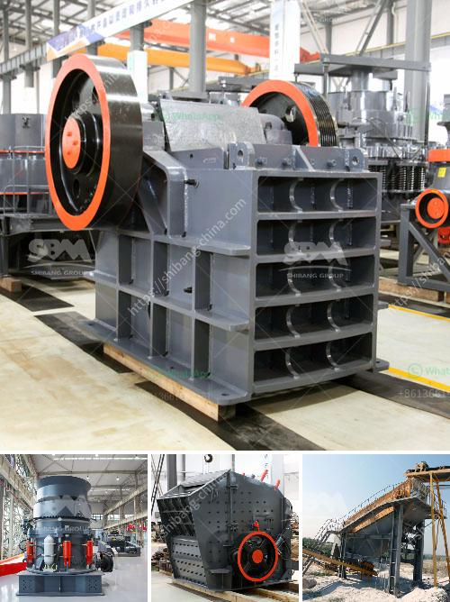

<h3>biggest cone crusher in africa</h3>
Africa, a continent known for its vast mineral wealth and diverse mining operations, has stepped up its game in the extractive industry. Over the years, technological advancements have been a catalyst for the progress witnessed across various sectors. In this context, the advent of the biggest cone crusher in Africa augurs well for the mining industry, boosting the continent's mineral processing capabilities while strengthening its position in the global market.

In a bid to meet the increasing demand for aggregate products and generate more revenue, South Africa-based mining company Atlantis Mining has unveiled Africa's largest cone crusher. Named the Metso MP2500, the technological masterpiece boasts a high processing capacity, making it the ideal choice for large-scale mining operations.

The Metso MP2500 cone crusher brings several key features necessary for efficient and productive operations. Sporting a massive feed opening, increased power transfer, and a reduced number of maintenance points, this cone crusher can handle even the toughest rock formations encountered in the continent's mining sites.

With a nominal capacity of 3,500 tons per hour, this impressive machine can effectively crush large quantities of ore, thereby accelerating the processing rates and maximizing production outputs. Additionally, the MP2500 is equipped with the Metso IC crusher automation system, promoting safer operations and seamless performance optimization.

1. Increased Production Efficiency: The MP2500's advanced design and robust construction facilitate efficient mineral processing, reducing downtime and improving overall operational efficiency. The enhanced production capability of the crusher ensures that mining operations can meet their targets and increase their profitability.

2. Reduced Environmental Impact: The cone crusher's innovative design emphasizes safety and environmental considerations. Enabled with the Metso IC crusher automation system, operators can monitor the crusher's performance, adjust settings, and optimize productivity, thereby reducing energy consumption and minimizing environmental impact.

3. Enhanced Economic Benefits: By investing in the largest cone crusher in Africa, mining companies can unlock the full potential of their mineral resources. High-capacity processing capabilities result in increased production outputs, generating more revenue both locally and globally. Moreover, the upgraded technology can attract foreign investments, further fueling economic growth in the sector.

The introduction of Africa's largest cone crusher, the Metso MP2500, signifies a positive stride towards bolstering the continent's mineral processing capabilities. Equipped with advanced features and boasting high capacities, the MP2500 is set to revolutionize large-scale mining operations in Africa.

With increased efficiency, reduced environmental impact, and enhanced economic benefits, this cone crusher promises a bright future for the mining industry. As Africa harnesses its vast mineral wealth, the MP2500 stands as a testament to the continent's progress and ambition, showcasing its potential to compete on the global stage.
<h3>Contact us</h3><ul><li><strong>Whatsapp:&nbsp;<a href="https://wa.me/8613661969651">+8613661969651</a></strong></li><li><a href="https://swt.shibang-china.com/?git&amp;zhl&amp;biggest cone crusher in africa"><strong>Online Service(chat now)</strong></a></li></ul><h3>Related</h3><ul><li><a href='micro powder grinder mill.md'>micro powder grinder mill</a></li><li><a href='cement grinding station quotations.md'>cement grinding station quotations</a></li><li><a href='china top limestone crusher brands.md'>china top limestone crusher brands</a></li><li><a href='pulverizing machines in south africa.md'>pulverizing machines in south africa</a></li><li><a href='business plan on manganese ore mining crusher.md'>business plan on manganese ore mining crusher</a></li></ul>