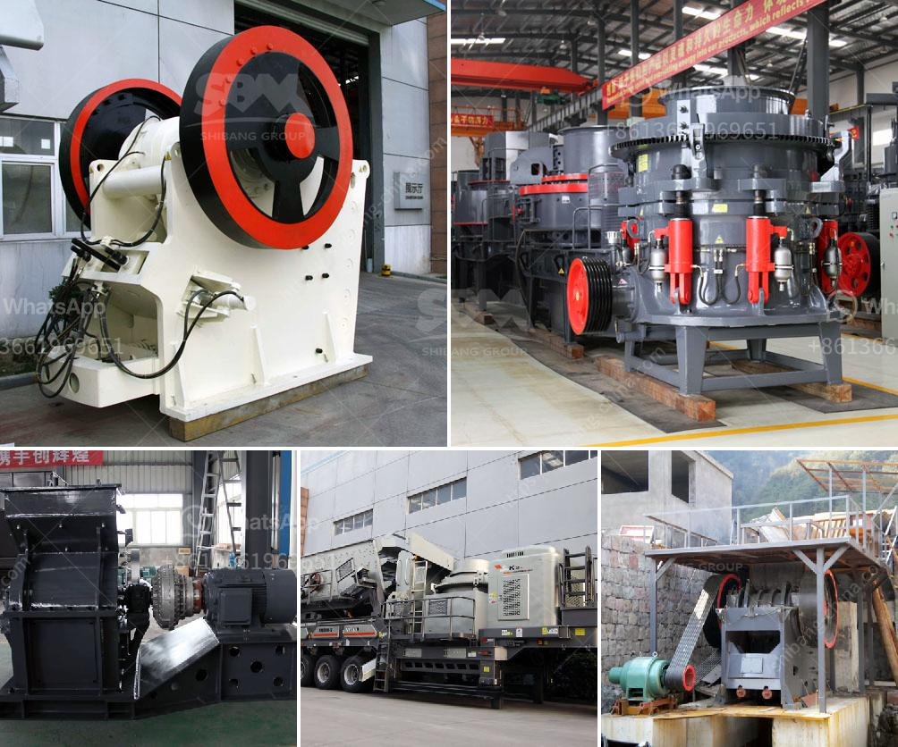

<h3>blake jaw crusher</h3>
The Blake Jaw crusher is one of the most commonly used types of crushers in the mining industry. It is mainly used as a primary crusher and it has a fixed feed area and a variable discharge area. Blake jaw crusher is suitable for coarse and medium crushing of various materials in mining, metallurgy, construction, road, railway, water conservancy and chemical industries.

The Blake Jaw crusher utilizes a toggle plate, which is a safety device. It provides a cushioning action to prevent the crusher from sudden shock or impact loads. This is particularly useful in mining industries where the ore is often loaded with large rocks. The Blake Jaw crusher operates by applying a compressive force to the material that gets fed into the chamber. The movable plate exerts force on the rock and forces it against the stationary plate, the rocks then remain between the jaws until the material is small enough to pass through the gap at the bottom of the jaws.

The Blake Jaw crusher is known for its ruggedness and its ability to crush hard and abrasive ores and rocks. This type of crusher has a movable jaw that is forced to move against the fixed jaw, hence the name "toggle" and "single toggle" jaw crusher.

The Blake Jaw crusher uses a double-toggle jaw crusher system due to its high capacity and larger feed size. The toggle plate is used to safeguard the crusher from any sudden impact and acts as a safety device. The gap between the jaws allows for adjustable discharge and the machine can be adapted to meet different crushing conditions.

In conclusion, the Blake Jaw crusher utilizes a variable feed area and a fixed discharge area which helps to reduce the size of rocks and stones. The Blake Jaw crusher is highly efficient and large crushing capacity helps for rapid reduction of large lump size. With mining activities becoming more focused on excavation of smaller mineral ores, the Blake Jaw crusher is now used less frequently and only for smaller ores and rocks.
<h3>Contact us</h3><ul><li><strong>Whatsapp:&nbsp;<a href="https://wa.me/8613661969651">+8613661969651</a></strong></li><li><a href="https://swt.shibang-china.com/?git&amp;zhl&amp;blake jaw crusher"><strong>Online Service(chat now)</strong></a></li></ul><h3>Related</h3><ul><li><a href='advantages and disadvantages of ball mill grinding.md'>advantages and disadvantages of ball mill grinding</a></li><li><a href='lime stone crusher spesifikasi.md'>lime stone crusher spesifikasi</a></li><li><a href='coal washing plant for sale grinding mill china.md'>coal washing plant for sale grinding mill china</a></li><li><a href='limestone crusher plant made in pakistan price.md'>limestone crusher plant made in pakistan price</a></li><li><a href='dolomite crusher plant in malaysia.md'>dolomite crusher plant in malaysia</a></li></ul>