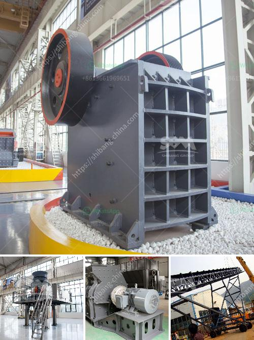

<h3>blands of quarry crusher plant ball mill</h3>
Quarry crusher plant ball mill is widely used in mining, smelting, road, building materials, chemical and other industries. It is the key equipment for grinding after the crush process. The mill consists of feeding device, driving assembly, rotating assembly, bearing unit, discharging assembly and foundation unit. There are many types of ball mills with different specifications, sizes, and power capacities.

One of the most commonly used ball mills in quarry crusher plants is the grate discharge ball mill. This mill has a grating at the discharge end to allow particles to flow out of the mill. Compared to overflow mills, grate discharge mills have higher capacity and lower power consumption. They can grind materials with a wide range of particle sizes, from small to large.

Another type of ball mill is the overflow ball mill, which has a simple structure and easy maintenance. It works by filling the mill with material and grinding media, then allowing the ground material to overflow through the discharge trunnion. Overflow ball mills are suitable for grinding fine particles and are often used in the secondary grinding process.

The third type of ball mill commonly used in quarry crusher plants is the rod mill. Rod mills are similar to ball mills but use long steel rods instead of grinding balls. The rods grind the ore by tumbling within the mill, similar to the grinding balls in a ball mill. Rod mills are typically used for grinding ores, coal/coke, and other materials for both wet and dry applications. They are particularly useful when a coarse product is required or when fine grinding is limited.

In addition to the above types, there are also autogenous mills, semi-autogenous mills, and vibration mills used in quarry crusher plants. Autogenous mills are designed for grinding large chunks of material by itself, without the need for grinding media. Semi-autogenous mills are a combination of autogenous and ball mills, where the grinding media is supplemented with additional steel balls. Vibration mills use vibrational energy to impart a grinding action to the material.

In conclusion, there are various types of ball mills used in quarry crusher plants, each suitable for different grinding needs. The choice of mill depends on factors such as the type of material being processed, the required particle size, and the desired production capacity. It is important to choose the right mill to ensure efficient and cost-effective grinding operations in quarry crusher plants.
<h3>Contact us</h3><ul><li><strong>Whatsapp:&nbsp;<a href="https://wa.me/8613661969651">+8613661969651</a></strong></li><li><a href="https://swt.shibang-china.com/?git&amp;zhl&amp;blands of quarry crusher plant ball mill"><strong>Online Service(chat now)</strong></a></li></ul><h3>Related</h3><ul><li><a href='stone sand making machine.md'>stone sand making machine</a></li><li><a href='business plan for clinker grinding plant.md'>business plan for clinker grinding plant</a></li><li><a href='best mobile jaw crusher 30 100tph.md'>best mobile jaw crusher 30 100tph</a></li><li><a href='cost of setting up gypsum processing factory.md'>cost of setting up gypsum processing factory</a></li><li><a href='stone crusher plant hire gold in zimbabwe.md'>stone crusher plant hire gold in zimbabwe</a></li></ul>