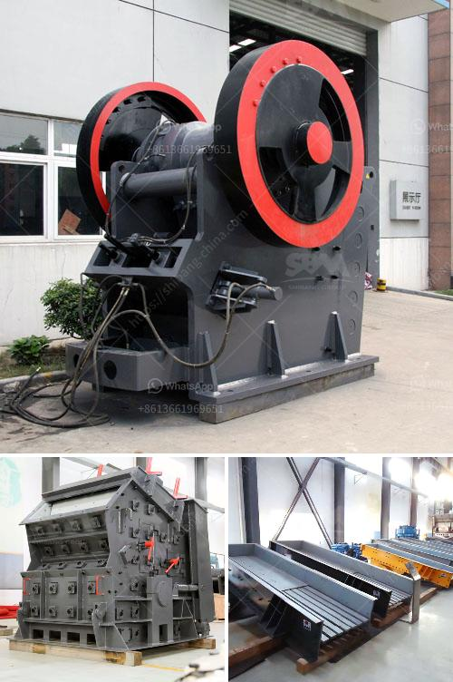

<h3>blue metal crusher product machine price coimbatore</h3>
Blue metal is a popular construction material in the quarry industry. It is used as a substitute for traditional sand and stones in various construction activities such as building foundations, bridges, roads, and dams. In Coimbatore, Tamil Nadu, blue metal is quarried, crushed, and processed to obtain blue metal chips of various sizes. Blue metal crusher machines are designed in a manner that helps reduce operating costs while increasing the productivity of their users.

The advent of automated devices in blue metal crusher plants has helped these businesses save both time and money. Although a relatively new entrant in the industry, blue metal crushing, and screening plants are already gaining prominence in the market. With their ability to produce aggregate efficiently, these machines are believed to be advantageous for the coimbatore region.

One of the primary reasons for the high demand for these machines is the low initial cost associated with them. Most blue metal crusher machines operate under the principle of mechanical compression, primarily depending on the application of an efficient electric motor. These crusher machines are of paramount importance for the construction industry in Coimbatore.

Some of the popular types of blue metal crushing equipment available in the market include the Bliss, Shaktiman, and Propel cone crushers. The Bliss crusher comes with a high-speed blow bar and hydraulic gap adjustment. This blue metal crusher machine price in Coimbatore is in the mid-range.

The Shaktiman crusher is robustly built with a high-power motor for faster crushing operations. The Propel crusher features a fixed shaft, lightweight liner, and several other advanced features to deliver superior performance. Its sturdy construction and innovative design make it a popular choice among blue metal quarry operators.

When it comes to buying a blue metal crusher machine, the most important factor is its price. Different manufacturers offer their machines at varying prices, depending on various factors such as quality, specifications, and features. The price range of these machines can vary from ₹2,00,000 to ₹10,00,000 or more. However, it is important to keep in mind that the cheapest option may not always be the most reliable or durable one.

Further, the prices of blue metal crusher machines also depend on factors like capacity, power consumption, and maintenance requirements. It is always advisable to do thorough research and compare different options before making a purchase decision. Additionally, buying from reputable manufacturers or dealers ensures that you get a genuine product with proper warranty and after-sales service.

Overall, the blue metal crusher product machine price in Coimbatore is relatively low and competitive. These machines are preferred by construction companies due to their excellent performance, easy operation, and low maintenance requirements. With the availability of different types and models, buyers have ample choices to find a suitable machine that meets their specific requirements and budget.

In conclusion, blue metal crusher machines are essential equipment in the blue metal quarry industry. They help reduce operating costs, increase productivity, and enhance the quality of blue metal aggregates. The blue metal crusher product machine price in Coimbatore is competitive and affordable for most businesses.
<h3>Contact us</h3><ul><li><strong>Whatsapp:&nbsp;<a href="https://wa.me/8613661969651">+8613661969651</a></strong></li><li><a href="https://swt.shibang-china.com/?git&amp;zhl&amp;blue metal crusher product machine price coimbatore"><strong>Online Service(chat now)</strong></a></li></ul><h3>Related</h3><ul><li><a href='dolomite powder making.md'>dolomite powder making</a></li><li><a href='crushers double toggle.md'>crushers double toggle</a></li><li><a href='how to make ball mill pdf.md'>how to make ball mill pdf</a></li><li><a href='rotary kiln untuk pengeringan batu kapur kapur.md'>rotary kiln untuk pengeringan batu kapur kapur</a></li><li><a href='china top limestone crusher brands.md'>china top limestone crusher brands</a></li></ul>