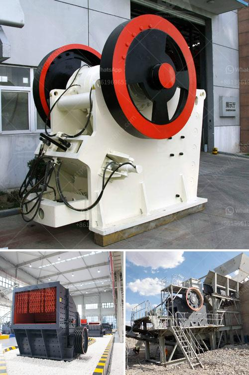

<h3>brick crusher line production</h3>
In today's world, where sustainability and environmental consciousness are crucial, finding innovative solutions to tackle construction waste has become a pressing need. One such solution is the implementation of brick crusher line production, a process that aims to recycle construction waste and transform it into reusable materials. This article explores the benefits and significance of brick crusher line production in reducing waste and contributing to a more sustainable construction industry.

Construction waste is a prevalent problem in the building industry, often accounting for a significant portion of landfill waste. This waste consists of leftover materials like bricks, tiles, concrete, and other rubble that result from construction and demolition projects. Addressing this issue is essential as it not only helps to minimize environmental impact but also reduces the need for new raw materials, ultimately conserving natural resources.

Brick crusher line production offers a viable solution that turns construction waste into valuable materials. This process involves the use of a brick crusher machine, which reduces the size of the waste material to be processed into usable aggregate. The crushed bricks can then be used as a base layer in construction projects, such as road sub-bases or foundations for buildings. Additionally, the crushed material can be further processed to create new bricks or recycled for other purposes.

One of the major advantages of brick crusher line production is that it significantly reduces landfill use. By diverting construction waste from landfills, this process helps to extend their lifespan and alleviate the environmental burden associated with waste disposal. Moreover, brick crusher line production contributes to a circular economy by promoting recycling and reusing materials rather than relying on traditional linear production models.

The sustainability benefits of brick crusher line production extend beyond waste reduction. By utilizing recycled materials, this process reduces the demand for new resources, such as clay and aggregates, which are often extracted through environmentally harmful mining practices. Additionally, the use of recycled materials helps to lower carbon emissions associated with the manufacturing of new materials, thus mitigating climate change impacts.

Implementing a brick crusher line production system requires collaboration between construction companies, waste management entities, and government bodies. These stakeholders need to invest in the necessary infrastructure and equipment to ensure the efficient processing of construction waste. Moreover, raising awareness and educating the public about the importance of recycling construction waste can foster support and participation in this sustainable practice.

In conclusion, brick crusher line production presents a sustainable solution for managing construction waste. By recycling and repurposing materials, this process helps to reduce landfill usage, conserve natural resources, and lower carbon emissions. Implementing brick crusher line production systems requires collective efforts among various stakeholders to invest in the necessary infrastructure and promote public awareness. Embracing this innovative approach can revolutionize the construction industry and pave the way for a more sustainable future.
<h3>Contact us</h3><ul><li><strong>Whatsapp:&nbsp;<a href="https://wa.me/8613661969651">+8613661969651</a></strong></li><li><a href="https://swt.shibang-china.com/?git&amp;zhl&amp;brick crusher line production"><strong>Online Service(chat now)</strong></a></li></ul><h3>Related</h3><ul><li><a href='dolomite crushing plant price in india.md'>dolomite crushing plant price in india</a></li><li><a href='buy new bal mill.md'>buy new bal mill</a></li><li><a href='gravel crusher machine philippines.md'>gravel crusher machine philippines</a></li><li><a href='gypsum factory machines in india.md'>gypsum factory machines in india</a></li><li><a href='hammer mill grinder 10 mm.md'>hammer mill grinder 10 mm</a></li></ul>