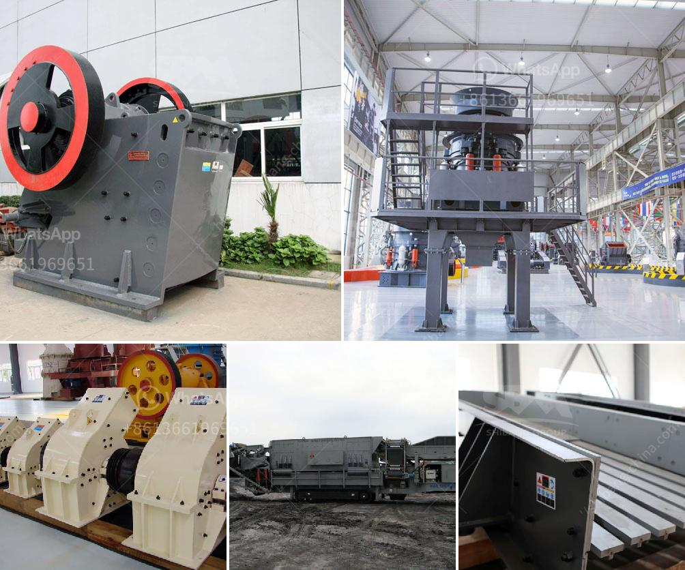

<h3>brick crushing equipment</h3>
Throughout history, bricks have been a fundamental construction material, providing the backbone for buildings, roads, and countless other structures. Unfortunately, the process of removing and reusing bricks has been a time-consuming and labor-intensive task, often requiring extensive manual labor. However, with the advent of brick crushing equipment, this ancient building technique is experiencing a revival, bringing numerous benefits to the construction industry.

Bricks have long been recognized for their durability and versatility. Made from a mixture of clay, shale, and other materials, they have been in use for over 5,000 years. A key advantage of bricks is their ability to withstand high pressure and extreme weather conditions, making them a staple component in millions of buildings worldwide. However, as buildings age, the need for renovation, remodeling, or demolition arises, necessitating the removal of bricks.

Traditionally, this process involved manually removing bricks, one by one, carefully separating them to preserve their integrity. This method was time-consuming, labor-intensive, and often resulted in damaged bricks. Furthermore, the already high cost of brick removal was exacerbated by the disposal fees associated with construction waste.

Enter brick crushing equipment. With the development of powerful and efficient machines, the process of brick removal has been revolutionized. These machines utilize high-powered hydraulic jaws to apply force to bricks, breaking them into smaller, reusable pieces. The resulting crushed bricks can then be used as fill material or recycled for a variety of purposes. This technology not only eliminates the need for manual labor but also significantly reduces the time required for brick removal.

The benefits of using brick crushing equipment are multifold. Firstly, it increases efficiency, allowing for faster and more cost-effective brick removal. This not only saves time but also reduces labor costs, making construction projects more affordable. Additionally, the crushed bricks can be utilized in various applications, such as road base material, landscaping, or aggregate replacement in concrete, thus reducing the need for virgin materials, minimizing waste, and contributing to a more sustainable construction industry.

Furthermore, brick crushing equipment opens up new opportunities for historical preservation and adaptive reuse of buildings. As the demand for preserving architectural heritage grows, the need to carefully remove and reuse building materials becomes paramount. With the advent of brick crushing equipment, historical buildings can be deconstructed without causing irreparable damage to the original bricks, allowing for a seamless reconstruction process while maintaining the authenticity of the structure.

In conclusion, brick crushing equipment represents a significant leap forward in the construction industry. By streamlining the brick removal process and providing an efficient means of recycling, it brings numerous benefits to builders, contractors, and preservationists alike. From increased efficiency and reduced labor costs to sustainability and historical preservation, brick crushing equipment encapsulates the spirit of innovation and tradition, revitalizing an ancient building technique for the modern world.
<h3>Contact us</h3><ul><li><strong>Whatsapp:&nbsp;<a href="https://wa.me/8613661969651">+8613661969651</a></strong></li><li><a href="https://swt.shibang-china.com/?git&amp;zhl&amp;brick crushing equipment"><strong>Online Service(chat now)</strong></a></li></ul><h3>Related</h3><ul><li><a href='construction of jaw crusher.md'>construction of jaw crusher</a></li><li><a href='types of coal crusher used in industry.md'>types of coal crusher used in industry</a></li><li><a href='rock crusher machine equipment in canada.md'>rock crusher machine equipment in canada</a></li><li><a href='crusher run for sale in sabah.md'>crusher run for sale in sabah</a></li><li><a href='sand washer for price.md'>sand washer for price</a></li></ul>