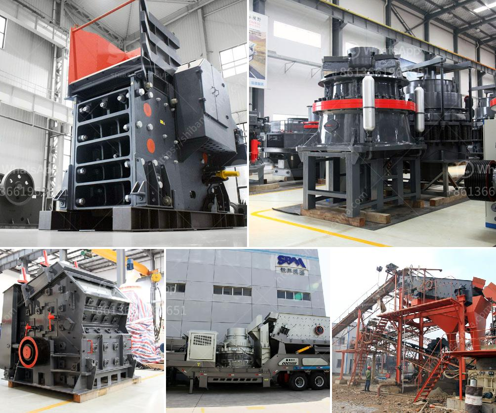

<h3>brick making machines for sale in zimbabwe</h3>
Brick making has been a traditional industry in Zimbabwe for many years, providing livelihoods for countless families and contributing to the country's infrastructure development. However, the process of manufacturing bricks manually can be arduous and time-consuming. This is where brick making machines come into play, revolutionizing the industry by increasing efficiency, reducing labor costs, and improving the quality of bricks.

In recent years, the demand for faster and more efficient brick making machines has been on the rise in Zimbabwe. As a result, several local and international manufacturers have started offering a wide range of brick making machines for sale in the country. These machines range from manual to semi-automatic and fully automatic models, catering to the diverse needs and budgets of brick manufacturers.

One of the key advantages of investing in a brick making machine is the substantial increase in production capacity. Manual brick making can only yield a limited number of bricks per day, whereas a machine can produce hundreds or even thousands of bricks in the same time frame. This not only contributes to meeting the growing demand but also allows manufacturers to expand their businesses and reach new markets.

Additionally, the use of brick making machines significantly reduces the need for manual labor. Traditionally, brick making required a labor-intensive process involving multiple workers, which can be costly and time-consuming. With the advent of machine-operated brick making, the labor force required is minimal, resulting in reduced labor costs and increased profitability for manufacturers.

Furthermore, brick making machines offer superior brick quality compared to manually produced bricks. These machines ensure consistent size, shape, and density, leading to a higher standard of construction and improved overall durability. The use of machines also allows for precise control over the raw materials used, resulting in stronger, more reliable bricks that can withstand the test of time.

In Zimbabwe, where the construction industry is booming due to urbanization and infrastructure development, investing in a brick making machine is a smart business move. With the right machine, brick manufacturers can capitalize on this growing demand and secure their position in the market.

When considering purchasing a brick making machine in Zimbabwe, there are several factors to take into account. Firstly, the production capacity of the machine should align with the anticipated demand. It is important to choose a machine that can meet current requirements while allowing for future expansion.

Secondly, the operational efficiency and ease of use of the machine should be considered. It is essential to select a machine that is user-friendly, ensuring that operators can quickly learn how to operate and maintain it effectively.

Additionally, it is advisable to choose a machine from a reputable manufacturer or supplier. This ensures access to reliable after-sales service and support, contributing to the longevity and reliability of the machine.

In conclusion, the availability of brick making machines for sale in Zimbabwe presents an exciting opportunity for the country's brick manufacturers. Investing in a machine not only increases production capacity and reduces labor costs but also improves the overall quality of bricks, contributing to sustainable development and economic growth. By choosing a suitable machine and supplier, brick manufacturers can position themselves at the forefront of the industry and maximize their profitability in this thriving market.
<h3>Contact us</h3><ul><li><strong>Whatsapp:&nbsp;<a href="https://wa.me/8613661969651">+8613661969651</a></strong></li><li><a href="https://swt.shibang-china.com/?git&amp;zhl&amp;brick making machines for sale in zimbabwe"><strong>Online Service(chat now)</strong></a></li></ul><h3>Related</h3><ul><li><a href='ballast crushers alibaba.md'>ballast crushers alibaba</a></li><li><a href='vertical mill china.md'>vertical mill china</a></li><li><a href='screw sand washing machine.md'>screw sand washing machine</a></li><li><a href='how to set up crusher.md'>how to set up crusher</a></li><li><a href='suppliers of chrome ore beneficiation plant.md'>suppliers of chrome ore beneficiation plant</a></li></ul>