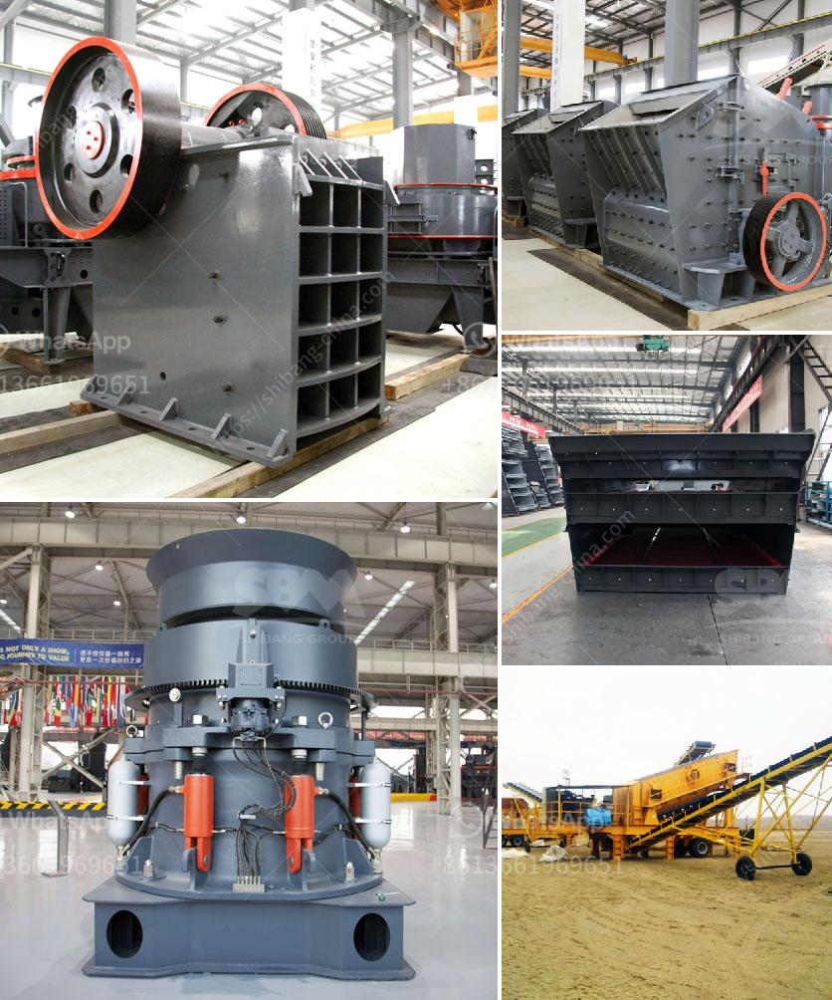

<h3>builders conveyor south africa</h3>
The construction industry has witnessed a significant transformation over the years, primarily due to the introduction of advanced machinery and equipment. Among the various technological innovations that have revolutionized the sector, builders conveyors have emerged as a game-changer in South Africa's construction landscape. These smart machines play a crucial role in enhancing efficiency, ensuring safety, and expediting work processes.

Builders conveyors are mechanical devices designed to transport construction materials, such as sand, gravel, and concrete, over short distances. These versatile machines are used to transfer materials within construction sites, eliminating the need for manual handling and reducing the risk of worker injuries. Moreover, builders conveyors promote a systematic workflow, ensuring that construction projects are completed on time, within budget, and to the highest quality standards.

One of the key advantages of builders conveyors is their ability to handle heavy loads with ease. These machines come equipped with sturdy belts and robust motors that can efficiently transport materials of varying weights and sizes. This feature is particularly beneficial in large-scale construction projects, where a significant amount of materials need to be moved quickly and safely.

Builders conveyors also offer unmatched flexibility in terms of their mobility. They are designed to be easily transported and set up at different locations within construction sites. This mobility allows construction workers to efficiently transport materials to areas that would otherwise be difficult to access manually. Additionally, builders conveyors can be adjusted to different heights and angles, further facilitating material transportation on uneven terrains or limited space areas.

Another notable advantage of using builders conveyors is their automated operation. These machines are equipped with user-friendly controls, enabling operators to easily adjust the speed, direction, and volume of material movement. This automation significantly reduces human intervention, resulting in improved accuracy and reduced operational errors.

The safety features of builders conveyors cannot be overlooked. These machines are designed with enhanced safety measures to protect workers and prevent accidents. For instance, many builders conveyors are equipped with emergency stop buttons, overload protection systems, and sensor mechanisms that promptly detect any abnormalities, automatically shutting down the machine to prevent hazardous situations.

Builders conveyors have also proven to be cost-effective investments for construction companies. By optimizing material transportation, these machines help minimize wastage and reduce labor costs. Additionally, the increased efficiency enabled by builders conveyors allows projects to be completed in shorter timeframes, resulting in significant cost savings.

In conclusion, builders conveyors have transformed the construction industry in South Africa by improving efficiency, enhancing safety, and expediting work processes. These versatile machines have become an integral part of construction sites, allowing for the effortless movement of heavy materials over short distances. The advantages offered by builders conveyors, such as their capacity to handle heavy loads, flexibility, automated operation, safety features, and cost-effectiveness, make them an indispensable asset in the modern construction landscape. As the industry continues to evolve, builders conveyors will undoubtedly play a vital role in accelerating progress and achieving future construction milestones.
<h3>Contact us</h3><ul><li><strong>Whatsapp:&nbsp;<a href="https://wa.me/8613661969651">+8613661969651</a></strong></li><li><a href="https://swt.shibang-china.com/?git&amp;zhl&amp;builders conveyor south africa"><strong>Online Service(chat now)</strong></a></li></ul><h3>Related</h3><ul><li><a href='gold washing plant for sale in south africa.md'>gold washing plant for sale in south africa</a></li><li><a href='stone crusher manufactured in new zealand.md'>stone crusher manufactured in new zealand</a></li><li><a href='crusher hammer crusher price for stone.md'>crusher hammer crusher price for stone</a></li><li><a href='calcium carbonate grinding.md'>calcium carbonate grinding</a></li><li><a href='jaw crushers 100tph.md'>jaw crushers 100tph</a></li></ul>