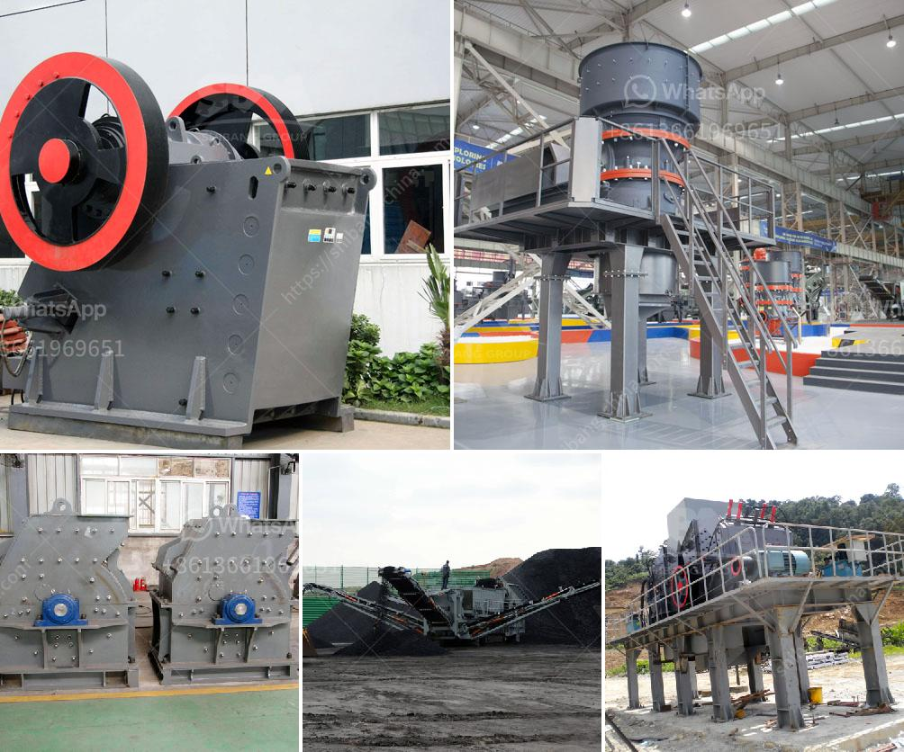

<h3>business plan for clinker grinding plant</h3>
A business plan is an essential document for any business that outlines its goals, strategies, and financial forecasts. It provides a roadmap for the business to follow and helps it to stay on track and focused on its objectives. When it comes to a clinker grinding plant, this business plan can be divided into four sections:

1. Introduction: The introduction section of the business plan should provide a brief overview of the clinker grinding plant. It should include information about the plant's location, capacity, and target market. Additionally, it should highlight the unique selling proposition of the plant that sets it apart from its competitors.

2. Market Analysis: The market analysis section should provide a detailed analysis of the clinker grinding plant's target market. This should include information about the demand for clinker in the local and regional markets, as well as any potential future growth opportunities. It should also provide an analysis of the plant's competition, including their market share, pricing strategies, and strengths and weaknesses.

3. Operations Plan: The operations plan section should provide a detailed description of how the clinker grinding plant will operate. This should include information about the plant's production processes, equipment requirements, and staffing needs. It should also outline the plant's quality control measures and any environmental or safety considerations.

4. Financial Plan: The financial plan section should outline the clinker grinding plant's projected financials. This should include information about the plant's expected revenue and expenses, as well as its profitability and return on investment. It should also include information about the plant's funding requirements and any potential sources of financing.

In conclusion, a business plan for a clinker grinding plant is essential to outline the plant's goals, strategies, and financial forecasts. It provides a roadmap for the business to follow and helps it to stay on track and focused on its objectives. By conducting a thorough market analysis, developing a detailed operations plan, and projecting the plant's financials, the business plan can help to ensure the success of the clinker grinding plant.
<h3>Contact us</h3><ul><li><strong>Whatsapp:&nbsp;<a href="https://wa.me/8613661969651">+8613661969651</a></strong></li><li><a href="https://swt.shibang-china.com/?git&amp;zhl&amp;business plan for clinker grinding plant"><strong>Online Service(chat now)</strong></a></li></ul><h3>Related</h3><ul><li><a href='buy new bal mill.md'>buy new bal mill</a></li><li><a href='150 tpd cement line price.md'>150 tpd cement line price</a></li><li><a href='granite crushers for sale.md'>granite crushers for sale</a></li><li><a href='gold wash plant equipment in ghana.md'>gold wash plant equipment in ghana</a></li><li><a href='raymond mill in kenya.md'>raymond mill in kenya</a></li></ul>