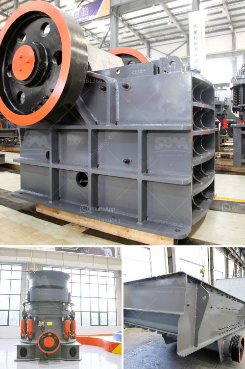

<h3>business plan for stone crushing plant pdf</h3>
The stone crushing plant for stone production is a crucial procedure in the business plan as it entails the purchase of valuable equipment such as crushers, crawler drills, excavators, and wheel loaders. Additionally, it is a key stone crusher plant machinery required for the crushing process of construction materials in mining and water conservancy projects. Therefore, it is important to ensure the orderly and smooth operation of the stone crushing plant.

To develop a business plan for stone crushing plant, you need to consider several factors. First, you need to analyze your target market and determine the demand for stone aggregates. Then, consider the competition in the market and identify your competitive advantage. You should also research the market trends and regulations related to stone crushing plants.

Once you have a clear understanding of the market, define your business objectives and goals. This includes deciding on the capacity and volume of stone aggregates you aim to produce. Additionally, determine the pricing strategy, marketing initiatives, and distribution channels that will help you reach your customers effectively.

When it comes to operational and financial planning, you need to establish the cost estimation for acquiring the necessary machinery, labor, and other resources. Prepare a detailed production plan, considering the daily, weekly, and monthly targets. Also, create a comprehensive budget that covers expenses such as raw materials, energy, maintenance, and marketing.

Another critical aspect is ensuring compliance with environmental and health safety measures. Obtain the necessary permits and licenses required to operate a crushing plant, and implement measures to minimize pollution and promote worker safety.

Creating a business plan for a stone crushing plant is a comprehensive and systematic framework that outlines the key activities and services required in the process. As such, this document will act as a roadmap for the venture, guiding its progression and success.
<h3>Contact us</h3><ul><li><strong>Whatsapp:&nbsp;<a href="https://wa.me/8613661969651">+8613661969651</a></strong></li><li><a href="https://swt.shibang-china.com/?git&amp;zhl&amp;business plan for stone crushing plant pdf"><strong>Online Service(chat now)</strong></a></li></ul><h3>Related</h3><ul><li><a href='manufacturers small concrete brokmachine bangkok.md'>manufacturers small concrete brokmachine bangkok</a></li><li><a href='gypsum powder production plants.md'>gypsum powder production plants</a></li><li><a href='used stone crushers in south korea.md'>used stone crushers in south korea</a></li><li><a href='mini cement plant cost in india.md'>mini cement plant cost in india</a></li><li><a href='calcium carbonate grinding.md'>calcium carbonate grinding</a></li></ul>