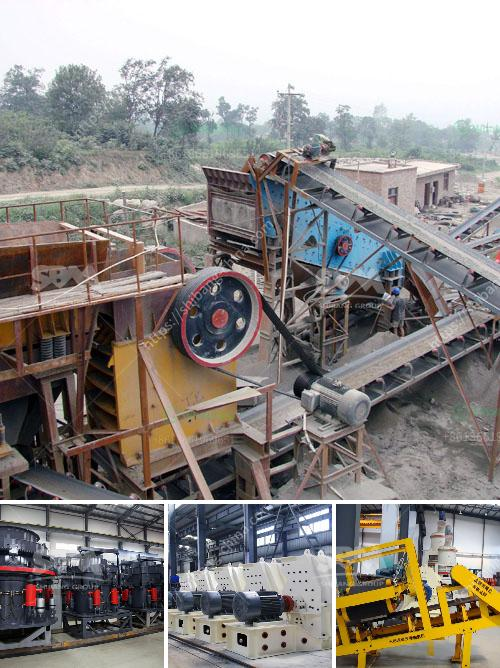

<h3>business plan on manganese ore mining crusher</h3>
A business plan on manganese ore mining crusher has ample opportunities to succeed in the lucrative mining industry. Manganese is a crucial mineral that is used in various metallurgical applications, making it an essential element in the production of steel. Manganese is also used in batteries, chemicals, and fertilizers, further increasing its demand in the market.

Establishing a manganese ore mining crusher requires upfront investment in acquiring mining sites, purchasing machinery, and obtaining necessary permits and licenses. The first step in creating a business plan is to conduct a comprehensive market analysis. Understanding the current demand and supply as well as the pricing trends will help in determining the viability of the venture.

The business plan should outline strategic partnerships and collaborations with local and international companies involved in the mining industry. Collaborating with established players will aid in securing necessary resources and accessing distribution channels. Moreover, partnerships will also provide access to expertise and technical knowledge, thereby ensuring successful operations.

Additionally, the business plan must include a detailed financial analysis, including projected revenue, expenses, and cash flow. The cost of machinery, personnel, and mining operations should be carefully estimated to derive accurate financial forecasts. The plan should also include a comprehensive marketing strategy to ensure the sale of the mined manganese ore.

Furthermore, it is crucial to outline environmental regulations and sustainable practices in the business plan. The mining industry often faces scrutiny due to its environmental impact. Demonstrating commitment to responsible mining practices and environmental conservation will enhance the credibility of the business and could attract potential investors.

Lastly, it is essential to include a risk assessment and mitigation strategy in the business plan. Mining operations face several risks, such as machinery breakdowns, labor disputes, and market fluctuations. Identifying potential risks and outlining strategies to mitigate them will instill confidence in lenders and investors. Adequate measures should also be taken to comply with safety regulations and provide a safe working environment for employees.

In conclusion, a well-developed business plan for a manganese ore mining crusher is crucial for success in this highly competitive industry. It requires thorough market analysis, strategic partnerships, accurate financial forecasting, sustainable practices, and risk management. With careful planning and execution, a manganese ore mining crusher business can thrive and contribute to the growing demand for manganese.
<h3>Contact us</h3><ul><li><strong>Whatsapp:&nbsp;<a href="https://wa.me/8613661969651">+8613661969651</a></strong></li><li><a href="https://swt.shibang-china.com/?git&amp;zhl&amp;business plan on manganese ore mining crusher"><strong>Online Service(chat now)</strong></a></li></ul><h3>Related</h3><ul><li><a href='fairly used stone crusher for sale nigeria.md'>fairly used stone crusher for sale nigeria</a></li><li><a href='price for china crusher.md'>price for china crusher</a></li><li><a href='graphite mining india.md'>graphite mining india</a></li><li><a href='20 tph ball mills price.md'>20 tph ball mills price</a></li><li><a href='jaw crusher 24x36.md'>jaw crusher 24x36</a></li></ul>