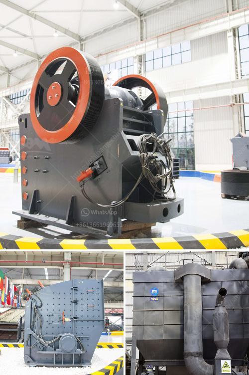

<h3>business proposal for stone crushing plant</h3>
Stone crushing is a crucial part of various industries, such as construction, mining, metallurgy, and chemistry. Whether stone crushers are needed for industrial purposes or for the manufacture of railway ballast, a business proposal for stone crushing plant must not be ignored. Furthermore, it is essential to consider factors such as production capacity, site selection, and capital investment.

To begin with, it is important to thoroughly analyze the market potential before developing a stone crushing plant. Market research will not only help in identifying potential customers but also aid in understanding their requirements and preferences. This knowledge will be beneficial in tailoring the production output of the plant to meet customer demands effectively.

Determining the production capacity of the plant is crucial while preparing the business proposal. Based on market research, it is necessary to estimate the anticipated demand and design the plant accordingly. This will include the sizing of the primary and secondary crushers, screens, and other machinery required to produce high-quality aggregates.

The selection of the site for the stone crushing plant is another important aspect that should be considered. The availability of raw materials, accessibility of the site for transportation, and the proximity to potential customers are significant factors in site selection. Additionally, it is essential to ensure that the site has the necessary infrastructure, such as water and electricity supply, to support the operation of the plant.

Capital investment is a critical element in any business proposal, and stone crushing plants are no exception. This investment should not only cover the cost of purchasing equipment but also include costs such as development, transportation, and installation. It is advisable to prepare a detailed financial analysis to determine the required capital investment and the anticipated return on investment.

Another crucial consideration is obtaining the necessary permits and licenses for operating the stone crushing plant. This may include obtaining permissions from local authorities, environmental clearances, and adherence to regulatory guidelines. Failure to comply with these requirements can lead to legal complications and disrupt the operation of the plant.

Operational costs, such as labor, maintenance, and energy consumption, should also be considered while preparing the business proposal. It is essential to estimate these costs accurately to ensure profitability and sustainability of the project. Implementing effective maintenance plans and employing efficient machinery can help in minimizing operational costs.

Moreover, it is important to pay attention to safety measures and environmental impact. Stone crushing plants can generate dust and noise, which may have adverse effects on workers' health and the surrounding environment. Furthermore, it is essential to implement measures such as proper dust control systems and regular monitoring to mitigate these risks.

In conclusion, a business proposal for a stone crushing plant should consider factors such as market potential, production capacity, site selection, capital investment, permits and licenses, operational costs, safety, and environmental impact. These factors will ensure that the proposal addresses the key aspects necessary for the successful establishment and operation of the plant. Ultimately, a well-prepared business proposal increases the chances of obtaining funding and support for the stone crushing plant project.
<h3>Contact us</h3><ul><li><strong>Whatsapp:&nbsp;<a href="https://wa.me/8613661969651">+8613661969651</a></strong></li><li><a href="https://swt.shibang-china.com/?git&amp;zhl&amp;business proposal for stone crushing plant"><strong>Online Service(chat now)</strong></a></li></ul><h3>Related</h3><ul><li><a href='quartz stone crusher application.md'>quartz stone crusher application</a></li><li><a href='stone sand making machine.md'>stone sand making machine</a></li><li><a href='ball mill manufacturers in bangalore machinery.md'>ball mill manufacturers in bangalore machinery</a></li><li><a href='gold ore crushers for sale in india.md'>gold ore crushers for sale in india</a></li><li><a href='hammer mill for sale south africa.md'>hammer mill for sale south africa</a></li></ul>