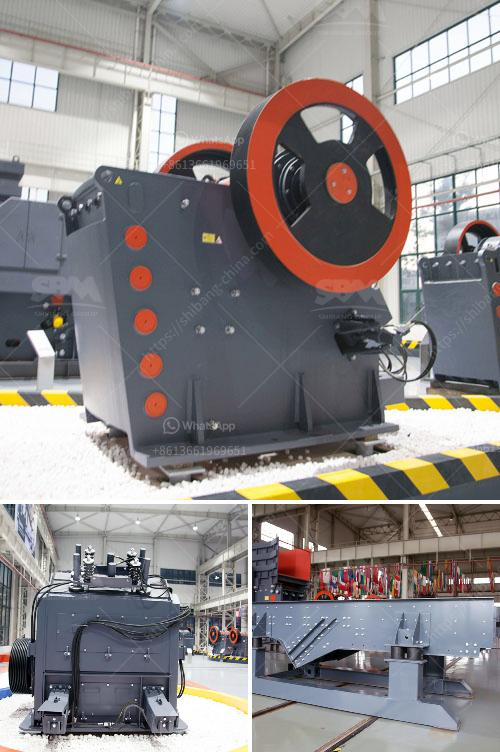

<h3>buy granite crusher</h3>
Granite is a tough and durable stone that is commonly used in construction projects. Whether you're building a new home or renovating your kitchen, adding granite countertops can enhance the beauty and value of your space. However, to achieve the desired look, it is essential to invest in a high-quality granite crusher.

When it comes to buying a granite crusher, there are several factors that need to be considered. First and foremost, you should ensure that the crusher is made from durable materials that can withstand the pressure of crushing granite. Look for crushers that are constructed from strong steel or cast iron, as these materials are known for their long-lasting performance.

Another important factor to consider is the size of the crusher. Depending on the scale of your project, you may need a crusher that can handle a large volume of granite. It is recommended to choose a crusher that has a wide mouth opening, as this will allow you to feed larger pieces of granite into the machine.

It is also crucial to consider the power source of the crusher. Some crushers operate on electricity, while others are powered by gasoline or diesel engines. Make sure to choose a crusher that matches the available power source in your project area.

Price is another vital aspect to consider when buying a granite crusher. While it is essential to invest in a high-quality crusher, you should also ensure that it fits within your budget. Compare prices from different manufacturers or suppliers to find the most cost-effective option that meets your requirements.

In conclusion, buying a granite crusher is a significant decision that should not be taken lightly. By considering factors such as material durability, size, power source, and price, you can make an informed choice and find a crusher that will effectively crush granite for your construction or renovation project.
<h3>Contact us</h3><ul><li><strong>Whatsapp:&nbsp;<a href="https://wa.me/8613661969651">+8613661969651</a></strong></li><li><a href="https://swt.shibang-china.com/?git&amp;zhl&amp;buy granite crusher"><strong>Online Service(chat now)</strong></a></li></ul><h3>Related</h3><ul><li><a href='grinding machine for industrial use.md'>grinding machine for industrial use</a></li><li><a href='used vertical grinding machine.md'>used vertical grinding machine</a></li><li><a href='small rock crusher for small scale aggregate producers.md'>small rock crusher for small scale aggregate producers</a></li><li><a href='limestone grinding roller mill.md'>limestone grinding roller mill</a></li><li><a href='mining crusher equipment south africa.md'>mining crusher equipment south africa</a></li></ul>