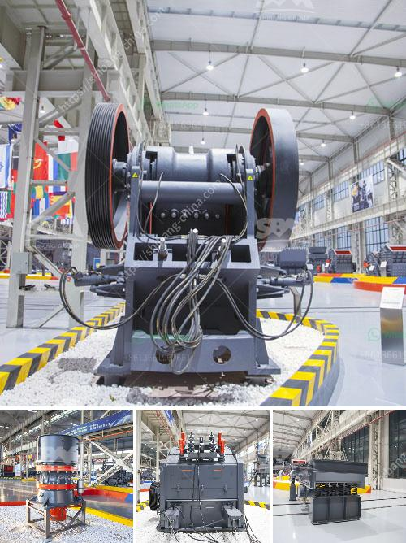

<h3>buy new bal mill</h3>
Are you a DIY enthusiast or a professional in need of a reliable and efficient ball mill? Look no further! In this article, we will explore the benefits of investing in a brand-new ball mill, perfect for all your grinding needs. Whether you are working with chemicals, minerals, or even food ingredients, a new ball mill can provide exceptional results.

One of the primary advantages of purchasing a new ball mill is the level of precision and consistency it offers. Unlike used mills, which may have worn-out components or outdated technology, a new ball mill is equipped with the latest features and improvements. This ensures that you can achieve accurate and repeatable results, maintaining the integrity of your work.

Moreover, a new ball mill comes with a warranty, giving you peace of mind and protection against any potential manufacturing defects. This means that if you encounter any issues during the warranty period, you can rely on the manufacturer's support to resolve them promptly. Investing in a new ball mill guarantees a trouble-free operation and a longer lifespan compared to a used one.

A new ball mill also allows you to customize its specifications according to your specific requirements. From the size and capacity to the speed and power, you have the flexibility to choose the most suitable model for your applications. Whether you need a small desktop ball mill for a home laboratory or a large industrial-sized mill for heavy-duty grinding, there is a wide range of options available on the market.

Another benefit of buying a new ball mill is the availability of technical support and expertise from the manufacturer. They can assist you with installation, set-up, and troubleshooting, ensuring a smooth start to your grinding operations. You can rely on their knowledge and experience to optimize your milling processes and experiment with different materials or formulations.

Furthermore, a new ball mill often incorporates advanced safety features to protect the operator and prevent accidents. These may include emergency stop buttons, protective covers, and integrated sensors to monitor temperature, vibration, or load. By prioritizing safety, you can create a secure working environment and reduce the risk of injuries or equipment damage.

Considering the long-term cost-effectiveness, a new ball mill is also an economical choice. While the initial investment may be higher compared to a used mill, the enhanced performance, reliability, and extended lifespan of a new mill justify the expense. Additionally, the improved efficiency and productivity achieved by using a new ball mill can lead to higher returns and savings in the long run.

In conclusion, if you are in the market for a ball mill, we highly recommend considering the purchase of a brand-new one. The advantages are countless, from precision and consistency to customization options and technical support. With a new ball mill, you can achieve optimal results in your grinding processes while ensuring a safe and durable machine. So don't hesitate, invest in a new ball mill today and elevate your grinding game!
<h3>Contact us</h3><ul><li><strong>Whatsapp:&nbsp;<a href="https://wa.me/8613661969651">+8613661969651</a></strong></li><li><a href="https://swt.shibang-china.com/?git&amp;zhl&amp;buy new bal mill"><strong>Online Service(chat now)</strong></a></li></ul><h3>Related</h3><ul><li><a href='the cost of chrome washing plants in south africa.md'>the cost of chrome washing plants in south africa</a></li><li><a href='small sacle crushers in zambia.md'>small sacle crushers in zambia</a></li><li><a href='coal washing process machine price.md'>coal washing process machine price</a></li><li><a href='coal processing plant in philippines.md'>coal processing plant in philippines</a></li><li><a href='russia equipment manufacturers mining.md'>russia equipment manufacturers mining</a></li></ul>