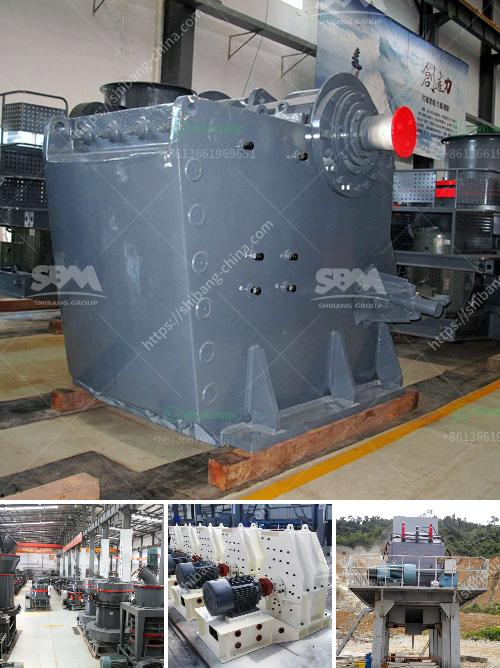

<h3>buy roller crusher</h3>
Roller crushers have proven to be an efficient and economical way to crush materials in various industries. They are widely used in sectors such as mining, quarrying, cement production, and construction, to name a few. These machines are known for their versatility, reliability, and low maintenance requirements.

One of the main advantages of roller crushers is their ability to produce a uniform grain size distribution. This is accomplished by the use of two parallel, counter-rotating rollers that create a compression force. The material is crushed by the rollers and then discharged at the bottom. The adjustable gap between the rollers allows for precise control over the final product size.

When considering the purchase of a roller crusher, it is important to focus on certain key aspects. Firstly, the capacity of the machine should be suitable for your specific needs. Roller crushers are available in different sizes and can handle different types of materials. Carefully analyze the required throughput and the characteristics of the material you intend to crush.

Secondly, pay attention to the roller design. The geometry of the rollers can significantly affect the crushing efficiency and the final product quality. Look for rollers that are designed to minimize wear and maximize the crushing force. Quality rollers will ensure a long lifespan and reduce the frequency of maintenance.

Another crucial factor to consider is the power source. Roller crushers can be powered by electricity or diesel engines. Choose the one that best suits your application requirements and the availability of the energy source.

Lastly, it is important to purchase from a reliable and reputable manufacturer or supplier. A reputable supplier can offer guidance and support throughout the purchasing process, as well as provide maintenance and spare parts when needed.

In conclusion, roller crushers are versatile machines that offer an efficient and cost-effective solution for crushing materials in various industries. To ensure a successful purchase, carefully analyze your specific requirements, consider the roller design and power source, and purchase from a reliable supplier. With the right roller crusher, you can improve your operational efficiency and enhance your overall productivity.
<h3>Contact us</h3><ul><li><strong>Whatsapp:&nbsp;<a href="https://wa.me/8613661969651">+8613661969651</a></strong></li><li><a href="https://swt.shibang-china.com/?git&amp;zhl&amp;buy roller crusher"><strong>Online Service(chat now)</strong></a></li></ul><h3>Related</h3><ul><li><a href='crusher machine manufacturers.md'>crusher machine manufacturers</a></li><li><a href='portable home gold processing machine.md'>portable home gold processing machine</a></li><li><a href='simple stone crushing machine price in kenya.md'>simple stone crushing machine price in kenya</a></li><li><a href='raymond mill manufacturer in india.md'>raymond mill manufacturer in india</a></li><li><a href='granite crusher factory.md'>granite crusher factory</a></li></ul>