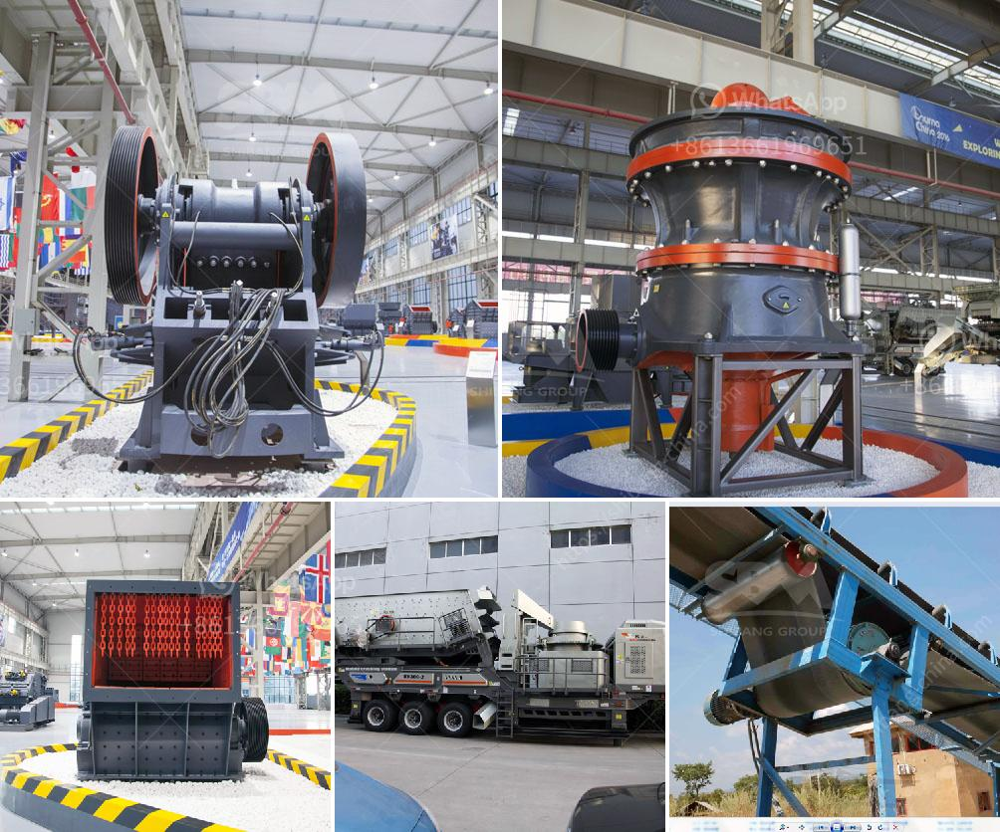

<h3>calcite grinding plant</h3>
Calcite is a mineral found in nature that has a crystalline structure and a variety of colors. It is widely used in various industries for its characteristics, including its high whiteness, chemical stability, and heat resistance. One of the most common applications of calcite is as a filler and coating material in the manufacturing of paper, rubber, paints, and plastics.

To meet the growing demand for calcite, various companies have established calcite grinding plants. These plants utilize specialized machinery, such as calcite grinding mills, crushers, and classifiers, to pulverize and classify the raw calcite ore into fine and ultrafine powders. Calcite grinding plants can be designed to suit various purposes and specifications, whether it is for industrial applications, such as cement, glass, or steel production, or for agricultural or environmental purposes, such as soil improvement or water treatment.

The process of grinding calcite involves several stages, such as crushing, screening, and grinding. After being mined, the raw calcite ore is crushed into smaller particles through crushing machines. The crushed calcite particles are then screened to separate the desired size fractions. The screened calcite particles are fed into grinding mills for further grinding. In the grinding mills, calcite particles are ground into a fine powder with the help of grinding media, such as steel or ceramic balls.

The resulting calcite powder can then be used in various applications, depending on its particle size and quality. Fine and ultrafine calcite powders are often used as fillers in coatings, plastics, and rubber products to improve their properties, such as hardness, gloss, and weather resistance. Coarser calcite powders, on the other hand, are commonly used in construction materials, such as cement and concrete, to enhance their performance, such as strength and durability.

In conclusion, calcite grinding plants play a crucial role in producing high-quality calcite powders used in various industrial and agricultural applications. With the advancement of technology, these grinding plants have become more efficient, cost-effective, and eco-friendly. They not only meet the market demand for calcite but also contribute to the sustainable development of industries and the overall economy.
<h3>Contact us</h3><ul><li><strong>Whatsapp:&nbsp;<a href="https://wa.me/8613661969651">+8613661969651</a></strong></li><li><a href="https://swt.shibang-china.com/?git&amp;zhl&amp;calcite grinding plant"><strong>Online Service(chat now)</strong></a></li></ul><h3>Related</h3><ul><li><a href='harga dan tipe stone crusher indonesia.md'>harga dan tipe stone crusher indonesia</a></li><li><a href='ton per hour gold wash plant.md'>ton per hour gold wash plant</a></li><li><a href='coal pulverisers machines.md'>coal pulverisers machines</a></li><li><a href='coal mining process machinery.md'>coal mining process machinery</a></li><li><a href='ballast crusher price in kenya.md'>ballast crusher price in kenya</a></li></ul>