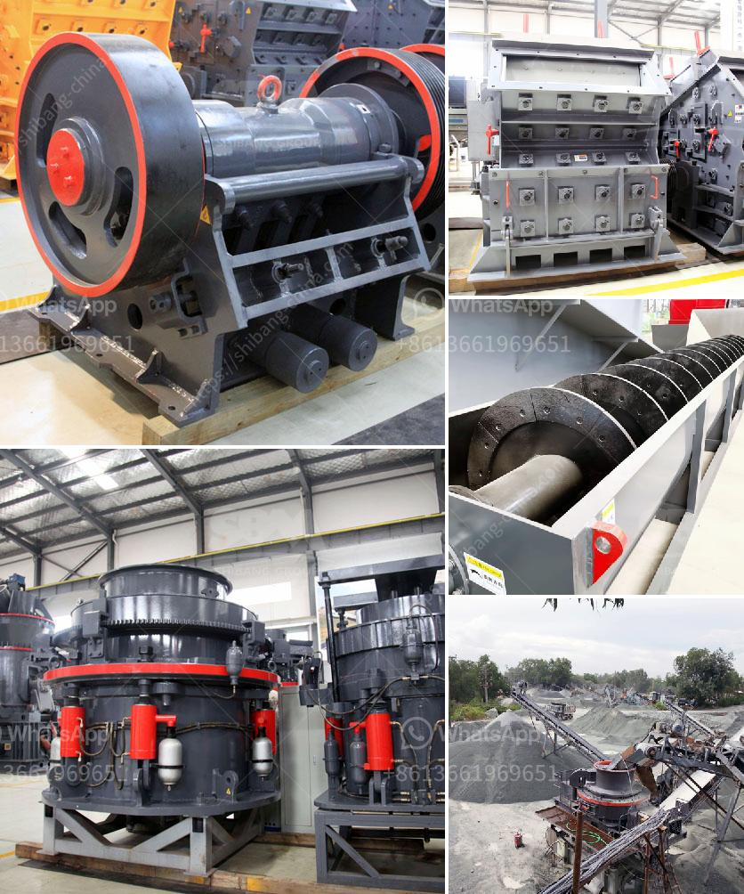

<h3>calcite quarry crusher sri lanka</h3>
Calcite is a kind of crystal-like calcium carbonate mineral, which belongs to the carbonate mineral group. It is known for its high transparency, beautiful color, and various shapes. Calcite is mined from quarries, which are naturally formed over thousands of years. One of the renowned calcite quarries is located in Sri Lanka.

Sri Lanka is an island country in South Asia, located in the Indian Ocean to the southwest of the Bay of Bengal. It is well-known for its rich heritage, stunning landscapes, and diverse wildlife. Apart from these attractions, Sri Lanka is also blessed with an abundance of natural resources.

The calcite quarry in Sri Lanka is spread over 11 acres and is equipped with the best machinery and resources to extract high-quality calcite stones. The quarry is located in the crystal paradise of Balangoda, which is a hub for crystal mining, making it an ideal location for mining activities.

The calcite quarry crusher in Sri Lanka primarily consists of jaw crusher, impact crusher, cone crusher, hammer crusher, VSI crusher, and MTM medium-speed trapezium mill. These different quarry crusher machines can be used for various purposes such as breaking stones into small pieces, reducing the size of stones, and producing aggregates for construction and road building.

The calcite quarry crusher machines incorporate cutting-edge technology and advanced features to simplify the crushing process and improve efficiency. Some of the noteworthy features of these crusher machines include a high crushing ratio, reliable performance, easy maintenance, and low operating costs.

The calcite quarry crusher in Sri Lanka has the capability to crush large stones into small pieces, ensuring that all stones pass through the crusher before reaching the final product. This significantly reduces the wastage of materials and increases the efficiency of the crushing process.

The quarry crusher machines are also equipped with advanced electronic control systems, which help in monitoring and controlling the production process. These control systems ensure that the crusher machines operate smoothly and efficiently, maximizing the productivity of the quarry.

Furthermore, the calcite quarry crusher in Sri Lanka utilizes a dust suppression system to control the emission of dust particles during the crushing process. This helps in reducing air pollution and creating a safe working environment for the quarry workers.

In addition to its advanced technology and efficiency, the calcite quarry crusher also plays a vital role in the local economy of Sri Lanka. The mining and quarrying industry contributes significantly to the country's GDP and provides employment opportunities for the local population.

Overall, the calcite quarry crusher in Sri Lanka is a highly productive quarrying solution and plays a crucial role in the development of Sri Lanka's mining industry. With its advanced technology and machinery, it provides customers with high-quality aggregates for construction and road building purposes, making it an essential asset for the country's infrastructure development.

In conclusion, the calcite quarry crusher in Sri Lanka showcases the country's rich natural resources and highlights its commitment to sustainable mining practices. With its advanced technology, efficiency, and contribution to the local economy, it proves to be a valuable asset for Sri Lanka's mining industry.
<h3>Contact us</h3><ul><li><strong>Whatsapp:&nbsp;<a href="https://wa.me/8613661969651">+8613661969651</a></strong></li><li><a href="https://swt.shibang-china.com/?git&amp;zhl&amp;calcite quarry crusher sri lanka"><strong>Online Service(chat now)</strong></a></li></ul><h3>Related</h3><ul><li><a href='sand and gravel separation machine.md'>sand and gravel separation machine</a></li><li><a href='gypsum crusher plants in pakistan.md'>gypsum crusher plants in pakistan</a></li><li><a href='impact crusher design.md'>impact crusher design</a></li><li><a href='stone crushers for sale in south africa.md'>stone crushers for sale in south africa</a></li><li><a href='crusher repairs south africa.md'>crusher repairs south africa</a></li></ul>