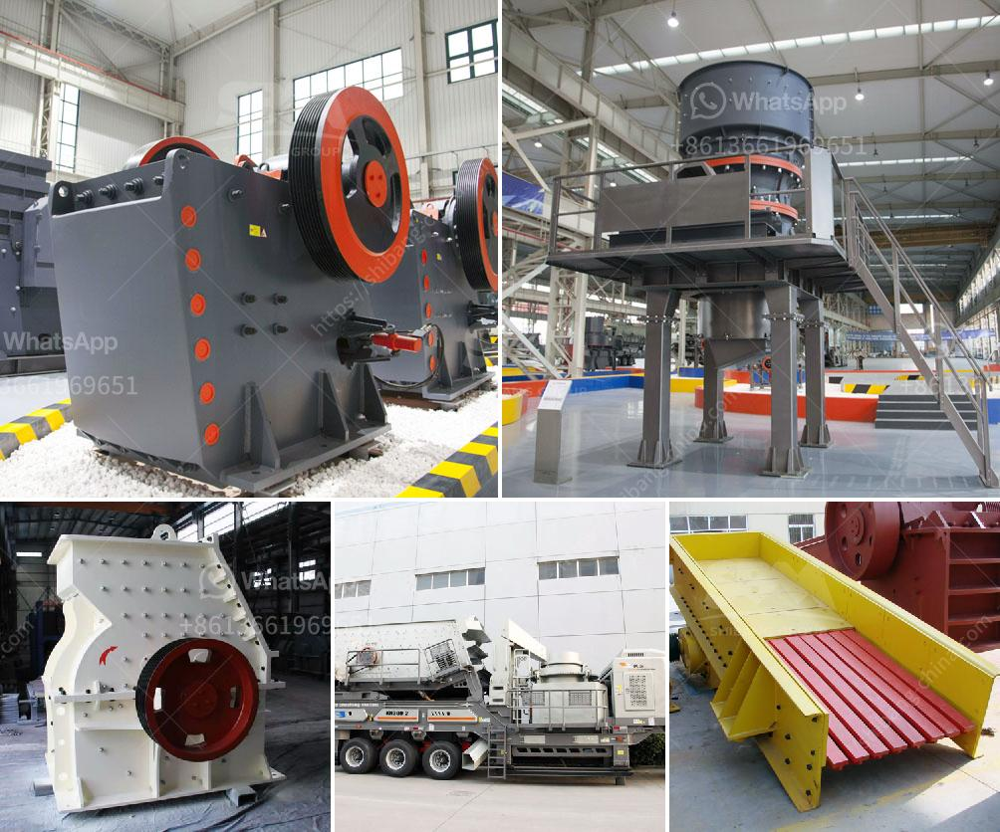

<h3>calcium calcium carbonate plants calcium</h3>
Calcium carbonate is an essential mineral that is found naturally in rocks and minerals such as limestone, marble, and chalk. It is widely used in various industries, including agriculture, construction, pharmaceuticals, and food production. Due to its versatile applications, the demand for calcium carbonate has been consistently high, leading to the establishment of calcium carbonate plants worldwide.

Calcium carbonate plants are industrial facilities that produce calcium carbonate from various sources. These plants typically employ different production methods, including extracting calcium carbonate from natural resources or synthesizing it chemically. The primary aim of these plants is to meet the growing demand for calcium carbonate in both domestic and international markets.

One of the most common methods used in calcium carbonate plants is the extraction from natural resources. This involves mining and processing limestone, a sedimentary rock containing high levels of calcium carbonate. The extracted limestone is then crushed and milled into fine particles, which are further treated to achieve the desired quality and purity. The processed calcium carbonate is then packaged and distributed to various industries for further application.

Synthetic production of calcium carbonate is another method used in calcium carbonate plants. It involves the chemical reaction between calcium hydroxide and carbon dioxide, resulting in the formation of calcium carbonate. This process is ideal when natural resources are limited or when specific properties of calcium carbonate are required. Additionally, synthetic production allows for better control over the final product's characteristics.

The application of calcium carbonate is vast and diverse. In the agricultural industry, calcium carbonate is widely used as a soil amendment to neutralize acidic soils and improve nutrient availability for plants. It also serves as a calcium supplement for animal feed to enhance bone development and overall health. In construction, calcium carbonate is a crucial component in the production of cement, concrete, and various building materials. Its high whiteness and brightness make it a popular choice in the paper and paint industry. Moreover, calcium carbonate is utilized in the pharmaceutical industry for its antacid properties and as a calcium supplement in dietary supplements.

The establishment of calcium carbonate plants provides numerous benefits to both the economy and the environment. These plants contribute to job creation and economic growth in the regions where they are located. They also reduce the dependency on imported calcium carbonate, thus improving domestic self-sufficiency. Additionally, calcium carbonate plants play a significant role in environmental conservation as they aim to utilize renewable resources and implement sustainable practices.

In conclusion, calcium carbonate plants are vital industrial facilities that produce calcium carbonate from natural resources or through chemical synthesis. These plants cater to the ever-growing demand for calcium carbonate across various industries. Calcium carbonate's wide range of applications makes it an essential mineral in agriculture, construction, pharmaceuticals, and food production. The establishment of calcium carbonate plants helps meet this demand, creates employment opportunities, and contributes to economic growth. Furthermore, these plants strive to implement sustainable practices, ensuring responsible use and conservation of resources.
<h3>Contact us</h3><ul><li><strong>Whatsapp:&nbsp;<a href="https://wa.me/8613661969651">+8613661969651</a></strong></li><li><a href="https://swt.shibang-china.com/?git&amp;zhl&amp;calcium calcium carbonate plants calcium"><strong>Online Service(chat now)</strong></a></li></ul><h3>Related</h3><ul><li><a href='iron ore crusher plant.md'>iron ore crusher plant</a></li><li><a href='bentonite crushing machine.md'>bentonite crushing machine</a></li><li><a href='cost of vertical roller mill.md'>cost of vertical roller mill</a></li><li><a href='portable concrete crushers.md'>portable concrete crushers</a></li><li><a href='mobile crusher capacity 200 ton per hour.md'>mobile crusher capacity 200 ton per hour</a></li></ul>